\begin{titlepage}
\vspace*{\fill}
\begin{center}

\texttt{\LARGE Applicazioni web} \\[1cm]
\texttt{\large Autore: Luca Pes} \\[0.5cm]
\texttt{\large Anno 2025-2026}

\end{center}
\vspace*{\fill}
\end{titlepage}
\newpage
\pagenumbering{Roman}
\tableofcontents
\newpage
\pagenumbering{arabic}

# WWW

**Internet** è una rete globale di reti che interconnette computer e reti locali. Si fonda su infrastrutture fisiche, protocolli e organismi che ne garantiscono il funzionamento e il trasporto delle informazioni.

Il **World Wide Web (WWW)** è un servizio che opera su Internet: fornisce accesso a documenti ipermediali distribuiti. Il Web utilizza il protocollo HTTP per trasferire le risorse; HTTP si appoggia a TCP/IP per il trasporto e al DNS per la risoluzione dei nomi e l'indirizzamento verso gli utenti.

Il Web è stato inventato da Tim Berners-Lee nel 1989 e ha rivoluzionato la comunicazione, l'informazione e il commercio. Oggi, il Web è una piattaforma essenziale per l'accesso a informazioni, servizi e intrattenimento, con miliardi di utenti in tutto il mondo.

I componenti principali del web includono:

- Hypertext: consente la creazione di documenti con collegamenti ipertestuali. <br>
- Protocolli : HTTP, HTTPS, FTP, ecc. <br>
- Web servers: ospitano e servono i contenuti web. <br>
- URI: identificatori univoci per risorse web. <br>
- User agents: software che accedono al web, come browser e bot. <br>

Un ipertesto si ottiene collegando documenti tramite link, creando una rete di informazioni accessibili da qualsiasi punto. Questo permette dei "salti" tra contenuti e documenti diversi, facilitando la navigazione e l'accesso alle informazioni.
Si parla di nodi e di link: i nodi sono i documenti, articoli o immagini (un'unità di informazioni significative); i link sono i collegamenti tra di essi. Un documento può essere raggiunto da più link, e un link può portare a più documenti. Questo crea una struttura complessa e interconnessa di informazioni.
Da ipertesto a ipermedia si passa includendo dei contenuti multimediali come immagini, audio e video. 

# Computer, Network, Addressing
È una macchina che esegue istruzioni elementari. I file elaborati e presi da internet devono essere "indicizzati" per essere facilmente accessibili. I computer sono organizzati in reti, che possono essere locali (LAN) o globali (Internet). La comunicazione tra computer avviene attraverso protocolli di rete, che definiscono le regole per la trasmissione dei dati.
Ci sono due memorie: RAM e HDD, i dati vengono spostati continuamente da una e l'altra. La RAM è più veloce ma volatile, mentre l'HDD è più lento ma permanente. I computer utilizzano un sistema operativo per gestire le risorse hardware e software, e un processore per eseguire le istruzioni.

Un indirizzo di memoria localizza un file all'interno del computer in modo tale che la CPU possa rintracciarli.

Gli indirizzi IP (Internet Protocol) sono numeri univoci assegnati a ogni dispositivo connesso a una rete, utilizzati per identificare e localizzare i dispositivi su Internet. Gli indirizzi IP possono essere statici (fissi) o dinamici (assegnati temporaneamente). Esistono due versioni principali di indirizzi IP: IPv4 (32 bit) e IPv6 (128 bit), con quest'ultima che offre un numero molto maggiore di indirizzi disponibili.

Quando digitiamo un URL (Uniform Resource Locator) in un browser, il processo di risoluzione dell'indirizzo IP avviene attraverso il DNS (Domain Name System). Il DNS traduce il nome di dominio (ad esempio, www.example.com) in un indirizzo IP

Internet è gestito a layer (OSI) che definisce i livelli di comunicazione tra dispositivi. I principali layer includono:

- Layer fisico: gestisce la trasmissione dei dati attraverso il mezzo fisico (cavi, onde radio, ecc.).
- Layer di collegamento dati: gestisce la comunicazione tra dispositivi sulla stessa rete.
- Layer di rete: gestisce l'instradamento dei dati tra reti diverse (es. IP).
- Layer di trasporto: gestisce la consegna affidabile dei dati tra host (es. TCP).
- Layer di sessione: gestisce le sessioni di comunicazione tra applicazioni.
- Layer di presentazione: gestisce la rappresentazione dei dati (es. codifica, compressione).
- Layer di applicazione: gestisce le applicazioni e i servizi di rete (es. HTTP, FTP, DNS).

La piramide può essere letta in due modi: dall'alto verso il basso che mostra come un dato sia "preparato" per la trasmissione (incapsulamento), e dal basso verso l'alto che mostra come un dato venga "elaborato/ricostruito" una volta ricevuto (decapsulamento).

Nella realtà si usa il modello TCP/IP che usa unicamente 4 layer: Network Interface, Internet, Transport e Application. Il modello OSI è più teorico e didattico, mentre TCP/IP è più pratico e utilizzato nella realtà.

# Client Server
Il modello client-server è un'architettura di rete in cui i client (utenti o dispositivi) richiedono servizi o risorse a un server (un computer o un programma che fornisce servizi). Il server elabora le richieste dei client e restituisce le risposte appropriate. Questo modello è alla base di molte applicazioni web, dove i browser (client) richiedono pagine web e dati a server web. Le risposte possono essere statiche o generate dinamicamente. Il contenuto dei messaggi viene trasmesso tramite l'uso del protocollo HTTP (o HTTPS), che definisce le regole per la comunicazione tra client e server. Il server può essere configurato per gestire più richieste contemporaneamente, garantendo un'esperienza utente fluida e reattiva.

Il web server è quello che realmente elabora le richieste e distribuisce le risorse sul web mentre l'application server genera un contenuto dinamico che viene poi distribuito dal web server. Il web server si occupa di gestire le richieste HTTP, mentre l'application server si occupa di eseguire la logica dell'applicazione e generare i contenuti dinamici.

L'application server esegue la logica server-side. Va a recuperare i dati da database, da APIs o da servizi esterni. Il web server si occupa di gestire le richieste HTTP, di servire i file statici e di inoltrare le richieste dinamiche all'application server. In questo modo, il web server funge da intermediario tra i client e l'application server, garantendo una gestione efficiente delle risorse e una migliore scalabilità dell'applicazione.

## Proxy
Un proxy è un intermediario tra un client e un server. Il client invia le richieste al proxy, che le inoltra al server e restituisce le risposte al client. I proxy possono essere utilizzati per migliorare la sicurezza, la privacy, la gestione del traffico e l'accesso a contenuti bloccati. Esistono diversi tipi di proxy, tra cui: Farword Proxy (agisce per conto del client), Reverse Proxy (agisce per conto del server).

# User Agent
Software che agisce per conto dell'utente, come i browser web, i client di posta elettronica e i bot. I browser web sono i user agent più comuni, consentendo agli utenti di accedere e interagire con il web. Gli user agent operano all'interno del modello client-server, inviando richieste ai server e ricevendo risposte. Altri esempi includono i crawlers che cercano all'interno del web delle informazioni. Ad esempio googlebot è un crawler che scansiona il web per indicizzare le pagine nei risultati di ricerca di Google.

Il web browser è un software che consente agli utenti di accedere e visualizzare le pagine web. Si ineressa anche a interpretare le risposte del server , come i file HTML, CSS e JavaScript, per renderizzare correttamente le pagine web.

Ciascuna risorsa nell'internet è identificata da un URI (Uniform Resource Identifier), che può essere un URL (Uniform Resource Locator) o un URN (Uniform Resource Name). Un URL specifica l'indirizzo di una risorsa e il protocollo da utilizzare per accedervi, mentre un URN è un identificatore univoco che non include informazioni sulla posizione della risorsa. Ad esempio, `http://www.example.com/index.html` è un URL, mentre `urn:isbn:0451450523` è un URN.

## MIME Type
Il compito del bs è quello di interpretare correttamente il contenuto della risposta, il server ci indica il mime type (Multipurpose Internet Mail Extensions) che ci dice di che tipo è il file (es. `text/html`, `image/jpeg`, `application/json`, ecc.) e il browser lo interpreta di conseguenza per renderizzare la pagina web o visualizzare l'immagine.

## User Agent String
La User Agent String è una stringa inviata dal browser al server che contiene informazioni sul browser stesso, il sistema operativo e altre caratteristiche del dispositivo. Questa stringa viene utilizzata dai server per identificare il tipo di client che sta effettuando la richiesta e per adattare la risposta di conseguenza. Ad esempio, un server potrebbe inviare una versione mobile di una pagina web se rileva che la User Agent String indica un dispositivo mobile. Il server può rispondere in maniera "personalizzata" a seconda del tipo di browser o dispositivo che sta effettuando la richiesta, migliorando così l'esperienza dell'utente.

### User Agent Spoofing
Lo Spoofing della User Agent String è una tecnica in cui un utente o un software modifica la User Agent String inviata al server per mascherare l'identità del browser o del dispositivo. Questo può essere fatto per vari motivi, come accedere a contenuti bloccati, testare la compatibilità del sito web o evitare il tracciamento. Ad esempio, un utente potrebbe modificare la User Agent String del proprio browser per far sembrare che stia utilizzando un dispositivo mobile, al fine di accedere a una versione mobile di un sito web che offre funzionalità limitate sulla versione desktop etc.

# HTTP
HTTP (Hypertext Transfer Protocol) è un protocollo di comunicazione utilizzato per trasferire dati su Internet. Definisce le regole da seguire tra client e server per la richiesta e la consegna di risorse web. Specifica come le richieste e le risposte sono formattate e come sono processate. Si basa sullo scambio di richieste e risposte tra client e server, utilizzando metodi come `GET`, `POST`, `PUT`, `DELETE`, ecc.

Segue il modello client - server , in cui il client invia una richiesta al server e il server risponde con la risorsa richiesta o un messaggio di errore. HTTP è un protocollo stateless, il che significa che ogni richiesta è indipendente e non mantiene lo stato tra le richieste. Per mantenere lo stato, si utilizzano i cookie, token o altre tecniche di sessione.

Per garantire lo stato si può inviare una richiesta al server con un dato che viene storato nel db e nella richiesta successiva si va a recuperare quel dato per identificare l'utente.

Quando nella pagina sono inclusi contenuti multimediali, il browser invia richieste separate per ciascuna risorsa (immagini, video, script, ecc.) e il server risponde con i dati corrispondenti. Prima di tutto chiede la pagina e poi manda richieste indipendenti per ogni risorsa. Questo processo è chiamato "richiesta multipla" ed è comune nelle pagine web che contengono molti elementi multimediali. L'User Agent poi si occupa di interpretare e "costruire" la pagina web finale con tutte le risorse ricevute dal server.

Ogni messaggio ha la struttura:

- start line: identidica il tipo di messaggio (richiesta o risposta) e contiene informazioni come il metodo HTTP, l'URL e la versione del protocollo.
- headers: metadati che forniscono informazioni aggiuntive sulla richiesta o sulla risposta, come il tipo di contenuto, la lunghezza del corpo, le informazioni sull'utente, ecc.
- body: il contenuto effettivo della richiesta o della risposta, che può essere vuoto o contenere dati come HTML, JSON, immagini, ecc.

La sintassi è: ```Metodo /(path) versione-protocollo (+ corpo)```

Il metodo HTTP specifica l'azione da eseguire sulla risorsa, come `GET` (recuperare dati), `POST` (inviare dati), `PUT` (aggiornare dati), `DELETE` (cancellare dati), ecc. L'URL specifica la risorsa a cui si vuole accedere, e la versione del protocollo indica quale versione di HTTP viene utilizzata per la comunicazione.
Il corpo della richiesta può contenere dati da inviare al server, come i dati di un modulo o un payload JSON.

La risposta ```HTTP/1.1 status-code status-massage (+ corpo)``` indica lo stato della richiesta, con il status code che rappresenta il risultato (es. `200 OK`, `404 Not Found`, `500 Internal Server Error`, ecc.) e la status-massage che fornisce una breve descrizione dello stato.
Il corpo della risposta contiene i dati restituiti dal server, tra cui header e contenuto. Gli header forniscono informazioni aggiuntive sulla risposta, come il tipo di contenuto, la lunghezza del corpo, le informazioni sul server, ecc. Il contenuto può essere una pagina HTML, un'immagine, un file JSON o qualsiasi altra risorsa richiesta dal client.

Codice di stato HTTP:

- 1xx: Informational (richiesta ricevuta, continua elaborazione)
- 2xx: Success (richiesta completata con successo)
- 3xx: Redirection (richiesta richiede ulteriori azioni per essere completata)
- 4xx: Client Error (errore causato dal client, es. richiesta malformata, risorsa non trovata)
- 5xx: Server Error (errore causato dal server, es. errore interno, servizio non disponibile)

## Evoluziozione di HTTP
HTTP/0.9: la prima versione di HTTP,supportava solo richieste e risposte semplici, senza funzionalità avanzate come la gestione delle connessioni persistenti o il supporto per i cookie. La richiesta non poteva contenere Header/Body per inviare dei dati al server

HTTP/1.1: introdotta nel 1996, ha aggiunto il supporto per i header e le connessioni persistenti, ma ogni richiesta richiedeva una nuova connessione TCP, causando inefficienze.

Per esempio 
```HTTP
POST /submit-form HTTP/1.1
Host: example.com
Content-Type: application/x-www-form-urlencoded
Content-Length: 27
username=example&password=1234
```

- `POST`: indica che si sta inviando un modulo al server.

- `/submit-form`: è il percorso della risorsa a cui si sta inviando la richiesta.

- `HTTP/1.1`: indica la versione del protocollo HTTP utilizzata.

- `Host: example.com`: specifica il nome del server a cui si sta inviando la richiesta.

- `Content-Type: application/x-www-form-urlencoded`: indica il tipo di contenuto del corpo della richiesta, in questo caso un modulo codificato.

- `Content-Length: 27`: indica la lunghezza del corpo della richiesta in byte.

- `username=example&password=1234`: è il corpo della richiesta, che contiene i dati del modulo codificati in formato URL.

Se l'utente clicca il link a `http://www.example.com/subdir/page2.html` Il browser manderà una richiesta per la nuova pagina del tipo:

```HTTP
GET /subdir/page2.html HTTP/1.1
Host: www.example.com
Referer: http://www.example.com/page1.html
Connection: keep-alive
User-Agent: Mozilla/5.0 (Windows NT 10.0; Win64; x64) 
	AppleWebKit/537.36 (KHTML, like Gecko) 
	Chrome/91.0.4472.124 Safari/537.36
Accept: text/html, image/webp, image/png, */*
Acccept-Encoding: gzip, deflate
```

- `Referer: http://www.example.com/page1.html`: indica la pagina da cui proviene la richiesta, utile per il tracciamento e l'analisi del traffico.

- `Connection: keep-alive`: indica che la connessione TCP deve essere mantenuta aperta per ulteriori richieste, migliorando l'efficienza.

- `User-Agent: Mozilla/5.0` `(Windows NT 10.0; Win64; x64)` `AppleWebKit/537.36`: fornisce informazioni sul browser e sul sistema operativo dell'utente, utile per il server per adattare la risposta.

- `Accept: text/html, image/webp, image/png, */*`: indica i tipi di contenuto che il client è disposto ad accettare in risposta.

- `Accept-Encoding: gzip, deflate`: indica i metodi di compressione che il client supporta, permettendo al server di inviare una risposta compressa per ridurre la dimensione dei dati trasferiti.

## HTTP Methods
I metodi HTTP specificano l'azione da eseguire sulla risorsa identificata dall'URL. I principali metodi HTTP sono:

- `GET`: recupera una risorsa dal server. Non dovrebbe avere un corpo nella richiesta e non dovrebbe modificare lo stato del server. La risorsa non viene modificata

- `HEAD`: simile a `GET`, ma restituisce solo gli header della risposta senza il corpo. Utile per verificare l'esistenza di una risorsa o ottenere informazioni sui metadati.

- `POST`: invia dati al server per creare o aggiornare una risorsa. Può avere un corpo nella richiesta e può modificare lo stato del server.

- `PUT`: simile a `POST`, ma viene utilizzato principalmente per aggiornare una risorsa esistente o crearne una nuova se non esiste. Può avere un corpo nella richiesta e può modificare lo stato del server.

- `DELETE`: elimina una risorsa dal server. Non dovrebbe avere un corpo nella richiesta e dovrebbe modificare lo stato del server.

Ci sono altri tre metodi meno usati:

- `OPTIONS`: restituisce le opzioni di comunicazione supportate dal server per una risorsa specifica. Utile per scoprire quali metodi HTTP sono supportati.

- `TRACE`: restituisce la richiesta ricevuta dal server, utile per il debug e l'analisi del traffico.

- `CONNECT`: stabilisce una connessione tunnel verso il server specificato, spesso utilizzato per il traffico HTTPS attraverso un proxy.

### GET Method

I browsers usano il get quando l'utente clicca su un link o quando si carica una pagina web. Il get è idempotente, il che significa che può essere chiamato più volte senza modificare lo stato del server. Il get non dovrebbe essere usato per inviare dati sensibili o modificare lo stato del server, poiché i dati vengono inviati nell'URL e possono essere facilmente intercettati o memorizzati nei log del server.

Si possono fare dei GET condizionali per evitare di scaricare risorse che non sono state modificate. Il client invia un header `If-Modified-Since` con la data dell'ultima versione della risorsa che ha, e il server risponde con un codice `304 Not Modified` se la risorsa non è stata modificata, evitando così di inviare nuovamente i dati.

Il get ha anche la possibilità di fare dei `GET` parziali, inviando un header `Range` con un intervallo di byte specifico. Il server risponde con un codice `206 Partial Content` e restituisce solo la parte della risorsa richiesta, utile per scaricare grandi file in più parti o per riprendere download interrotti.

### HEAD Method
Viene utilizzato principalmente per verificare l'esistenza di una risorsa o ottenere informazioni sui metadati senza scaricare il corpo della risposta. Supporta la validazione della cache , poiché restituisce gli stessi header di una richiesta `GET`, consentendo al client di verificare se la risorsa è stata modificata senza scaricarla nuovamente.

### POST Method
Il client usa il POST per inviare dei dati, il server può creare una nuova risorsa se non presente o elabora i dati per soddisfare la richiesta. Il server di solito scieglie il nuovo address della risorsa creata e lo restituisce nell'header `Location` della risposta. Il codice `201 Created` viene restituito quando una nuova risorsa è stata creata con successo. 
Quando il client conosce l'address della risorsa è più conveniente usare il metodo `PUT`.

### PUT Method
Il Client crea o aggiorna una risorsa specifica (a un address preciso) Viene restituito `200 OK` o `204 No Content` se la risorsa è stata aggiornata con successo, o `201 Created` se è stata creata una nuova risorsa. Una richiesta continua di `PUT` uguale porta sempre allo stesso risultato, è idempotente.

### DELETE Method
Quando la risorsa specificata dal client esiste viene eliminata e viene restituito `200 OK` o `204 No Content`. Se la risorsa non esiste, il server può restituire `404 Not Found` o `204 No Content`, a seconda dell'implementazione del server. Il `404` deriva dal fatto che richiedere l'eliminazione di una risorsa non esistente implica un errore del client.

## Idempotenza
Un metodo HTTP è idempotente se può essere chiamato più volte senza modificare lo stato del server dopo la prima chiamata. In altre parole, l'effetto di una richiesta idempotente è lo stesso indipendentemente dal numero di volte che viene eseguita. I metodi `GET`, `HEAD`, `PUT` e `DELETE` sono idempotenti, mentre `POST` non lo è. L'idempotenza è importante per garantire la sicurezza e l'affidabilità delle applicazioni web, poiché consente ai client di ripetere le richieste senza preoccuparsi di causare effetti collaterali indesiderati sul server.

Una `POST` non idempotente può causare problemi se viene eseguito più volte, ad esempio, se un utente invia un modulo di acquisto e poi aggiorna la pagina, potrebbe inviare nuovamente la richiesta `POST`, causando l'acquisto di più articoli. In questo caso, è importante implementare meccanismi per prevenire richieste duplicate, come l'uso di token unici o la gestione dello stato della sessione. Con un altro esempio, se un utente invia una richiesta `POST` per creare un nuovo account e poi aggiorna la pagina, potrebbe creare più account con lo stesso nome utente, causando confusione e problemi di gestione degli utenti.

## ESEMPI
```
POST /users HTTP/1.1
Host: example.com
Content-Type: application/json
{
  "username": "newuser",
  "email": "..."
  ...
}
```
Viene restituito
```
HTTP/1.1 201 Created
Content-Type: application/json
{
  "id": 123,
  "username": "newuser",
  "email": "..."
  ...
}
```
Numerose `POST` creerebbero risorse multiple con identificatori diversi, mentre una `PUT` con lo stesso identificatore sovrascriverebbe la stessa risorsa, mantenendo un unico account con lo stesso nome utente.
```
PUT /users/123 HTTP/1.1
Host: example.com
Content-Type: application/json
{
  "username": "newuser",
  "email": "..."
  ...
}
```
Viene restituito
```
HTTP/1.1 200 OK
Content-Type: application/json
{
  "id": 123,
  "username": "newuser",
  "email": "..."
  ...
}
```
## Headers
Gli header HTTP sono coppie chiave-valore che forniscono informazioni aggiuntive sulla richiesta o sulla risposta. Gli header possono essere utilizzati per specificare il tipo di contenuto, la lunghezza del corpo, le informazioni sull'utente, le direttive di cache, le autorizzazioni, ecc. Gli header sono fondamentali per la comunicazione tra client e server, poiché consentono di trasmettere informazioni importanti che influenzano il comportamento della richiesta o della risposta.

### Categorie di header
- `Request headers`: inviati dal client al server per fornire informazioni sulla richiesta, come `User-Agent`, `Accept`, `Authorization`, ecc.

- `Response headers`: inviati dal server al client per fornire informazioni sulla risposta, come `Content-Type`, `Content-Length`, `Set-Cookie`, ecc.

- `Rapresentational headers`: specificano il formato dei dati, come `Content-Type`, `Accept`, `Accept-Encoding`, ecc.

- `General headers`: forniscono informazioni generali sulla richiesta o sulla risposta, come `Date`, `Cache-Control`, `Connection`, ecc.

#### Request headers

- `User-Agent`: fornisce informazioni sul browser e sul sistema operativo dell'utente.
- `Accept`: indica i tipi di contenuto che il client è disposto ad accettare in risposta.
- `Host`: specifica il nome del server a cui si sta inviando la richiesta.
- `Authorization`: contiene le credenziali per l'autenticazione del client al server.
- `Accept-Encoding`: indica i metodi di compressione che il client supporta.
- `Cookie`: contiene i cookie inviati dal client al server.

#### Response headers
- `Content-Type`: indica il tipo di contenuto del corpo della risposta.
- `Content-Length`: indica la lunghezza del corpo della risposta in byte.
- `Set-Cookie`: contiene i cookie che il server vuole impostare nel client.
- `Cache-Control`: specifica le direttive di cache per la risposta.
- `Location`: specifica l'URL a cui il client deve essere reindirizzato dopo una richiesta POST o PUT.

# URI 
(Indentificatori Uniformi di Risorse) Identificano una risorsa su Internet. Un URI può essere un `URL` (Uniform Resource Locator) o un `URN` (Uniform Resource Name). Un `URL` specifica l'indirizzo di una risorsa e il protocollo da utilizzare per accedervi, mentre un `URN` è un identificatore univoco che non include informazioni sulla posizione della risorsa. Ad esempio, `http://www.example.com/index.html` è un `URL`, mentre `urn:isbn:0451450523` è un `URN`.

## Risorsa
Per risorsa si intende qualsiasi cosa possa essere referenziato (identificato da un indirizzo) o scambiato sul web come immagini, file, flussi di Byte etc. È indipendente dal percorso, formato o storage.

## URI (Uniform Resource Identifier)
È una stringa strutturata che indentifica una risorsa. Prevede uno standard per referenziare le risorse attraverso i sistemi. Gli URI sono usati per connettere risorse in documenti di tipo hypermedia e applicazioni. 

Un buon indirizzo URI è leggibile, breve, stabile e significativo. Deve essere progettato per essere facilmente comprensibile e memorizzabile dagli utenti, evitando l'uso di caratteri speciali o numeri non significativi. Deve rimanere persistente nel tempo e rimanere indipendente dal tipo di piattaforma o tecnologia utilizzata per ospitare la risorsa.

Si divide in opachi o gerarchici. Gli URI opachi non hanno una struttura gerarchica e non contengono informazioni sulla posizione della risorsa, mentre gli URI gerarchici seguono una struttura gerarchica che riflette la posizione della risorsa all'interno di un sistema di organizzazione.

Paradigma REST promuove l'uso di URI significativi e ben progettati per identificare le risorse in un'architettura web, facilitando così l'accesso e l'interazione con le risorse attraverso il protocollo HTTP.

```
scheme:[//authority]path[?query][#fragment]
```

- scheme: specifica il protocollo da utilizzare per accedere alla risorsa (es. http, https, ftp, mailto, ecc.).
- autority: contiene informazioni sull'host e, facoltativamente, sulla porta e sulle credenziali di autenticazione
- path: specifica il percorso della risorsa all'interno del server.
- query: contiene i parametri di ricerca o di filtro per la risorsa.
- fragment: specifica una sezione o un punto specifico all'interno della risorsa.


La differenza principale tra URN e URL è che il primo identifica una risorsa in modo univoco senza fornire informazioni sulla sua posizione, mentre il secondo specifica l'indirizzo della risorsa e il protocollo da utilizzare per accedervi.

## URL (Uniform Resource Locator)
La parte di path e query raggiunge il server mentre la parte di fragment è gestita dal client. Seleziona una porzione della risorsa restituita dal server (recensione di un libro etc) portandoci nella pagina web alla sezione specifica.

In un `URL` lo schema corrisponde a un protocollo per accedere alla risorsa come `http`, `https`, `ftp`. 

Alcuni Schemi fanno partire delle applicazioni nel client, ad esempio `mailto:` apre il client di posta elettronica predefinito per inviare un'email all'indirizzo specificato.

### Authority
La parte delle info sull'user sono opzionali, se presenti contengono le credenziali per l'autenticazione al server. Se presente vengono messi prima del nome dell'host e separati da una chiocciola (@).

Successivamente c'è l'host identificato dal suo nome di dominio o dall'indirizzo ip corrispondente. Se è presente una porta, viene specificata dopo l'host e separata da due punti (:). Se la porta non è specificata, viene utilizzata la porta predefinita per il protocollo indicato nello schema (es. 80 per `HTTP`, 443 per `HTTPS`, 8080 per una `HTTP` alternativa 0 3000 per lo sviluppo `HTTP`).

Userinfo, host e port fanno parte dell'autority dell'URL.

### Path
Identifica la risorsa all'interno del server. È strutturata in maniera gerarchica (come il file system). Può essere composta da più segmenti separati da una barra (/). Il path viene utilizzato dal server per determinare quale risorsa restituire in risposta a una richiesta `HTTP`.

Può far riferimento a un documento, un servizio o una applicazione.

### Query
La query appare dopo il carattere '?' e contiene parametri addizionali. Vengono usate per ricerche, filtri e ordinamenti. I parametri sono rappresentati come coppie chiave-valore separate da un simbolo di uguale (=) e i parametri multipli sono separati da un simbolo di e commerciale (&). Ad esempio, in `http://www.example.com/search?q=keyword&sort=asc`, la query contiene due parametri: `q` con il valore `keyword` e `sort` con il valore `asc`. [q = query]

## URL assoluti e relativi

Gli URL assoluti forniscono l'intero indirizzo della risorsa, un URL relativo fornisce solo il pezzo di indirizzo che viene interpretato e risolto sulla base del base URL.

`http://www.example.com/dir/subpage.html`

Ha come base url: `http://www.example.com/dir/` e relativo `subpage.html`

La risoluzione dell'URL è il processo che trasforma l'URL relativo in uno assoluto.

Un base URL senza '/' viene trattato come un file mentre con '/' finale viene trattato come una directory. Questa differenza è importante per la risoluzione degli URL relativi, poiché determina come vengono interpretati i percorsi relativi. Ad esempio, se il base URL è `http://www.example.com/dir` (senza '/'), un URL relativo come `subpage.html` verrebbe risolto come `http://www.example.com/subpage.html`, mentre se il base URL è `http://www.example.com/dir/` (con '/'), lo stesso URL relativo verrebbe risolto come `http://www.example.com/dir/subpage.html`.

Ci sono delle convenzioni di base per i path relativi:

- `./` indica la directory corrente.
- `../` indica la directory padre.
- `/` indica la radice del server.
-  `nome_percorso` indica un percorso relativo alla directory corrente.
e a seconda del base URL e dell'URL relativo mi porta a un risultato diverso (basato su queste convenzioni).

Può essere comodo avere un URL di base diverso da quello di root per organizzare meglio le risorse e semplificare la gestione degli URL relativi.

La parte di Scheme e di Host sono case insensitive mentre la parte di path è case sensitive (a seconda del server, ad esempio su Windows non è case sensitive mentre su Linux lo è). La parte di query è case sensitive. La parte di fragment è case sensitive. 
La porta di default può essere omessa e si raggiunge lo stesso risultato, ad esempio `http://www.example.com` è equivalente a `http://www.example.com:80` per HTTP. Se si specifica una porta diversa da quella di default, è necessario includerla nell'URL per accedere alla risorsa corretta.

### Stable URL
Un `URL` stabile evita di esporre dettagli di implementazione come filename o tecnologie interne. Un `URL` leggibile indica anche una forte segmentazione del path che va a riflettersi in una forte gerarchia di risorse. 

Un `URL` stabile e leggibile non ha token pemporanei o identificatori di sessione.

### URL Encoding
L'`URL` encoding è un processo che consente di rappresentare caratteri speciali e spazi all'interno di un `URL` in modo sicuro. I caratteri speciali vengono sostituiti con una sequenza di caratteri percentuali (%) seguita dal codice esadecimale del carattere. Ad esempio, uno spazio viene codificato come `%20`. L'`URL` encoding è necessario perché alcuni caratteri hanno significati speciali all'interno degli `URL` e potrebbero causare problemi se non vengono codificati correttamente.

I caratteri più importanti sono appunto lo spazio, il simbolo (?) codificato come `%3F`e lo slash (/) codificato come `%2F`. 

Per codificare un carattere speciale si scrive `%` seguito dal codice esadecimale del carattere.

## GET Parameters
I parametri di query vengono utilizzati per inviare dati al server attraverso l'`URL`. Si possono inserire solo nella `GET` e non nella `POST` che vengono invece inseriti nel corpo o nell'header della `POST`.

I parametri appaiono dopo '?' e sono sempre coppie `key=value`. Anche in questo caso bisogna fare l'encoding dei caratteri speciali solo quando sono parte dei dati e non quando sono parte della sintassi dei parametri (es. & e =). Gli spazi sono invece codificati come un + mentre se fa parte dei dati viene codificato come `%2B`.

Si possono anche specificare due valori per lo stesso parametro sempre in coppia `key=value` separati da &. L'ordine ovviamente non è importante e porta allo stesso risultato

# JSON
Si possono annidare oggetti `JSON` all'interno di altri creando una struttura ad albero. Un oggetto `JSON` è una collezione di coppie chiave-valore racchiusa tra parentesi graffe `{}`. Le chiavi sono stringhe e i valori possono essere di diversi tipi, come stringhe, numeri, booleani, array o altri oggetti `JSON`. Gli array `JSON` sono elenchi ordinati di valori racchiusi tra parentesi quadre `[]`. I valori all'interno di un array possono essere di qualsiasi tipo `JSON`, inclusi altri array o oggetti `JSON`.

```JSON
{
	"course": "Applicazioni Web",
	"lecturer": "Prof. Rossi",
	"year": 2024,
	"topics": [
		"HTTP",
		"URI",
		"Client-Server",
		"User Agent"
	]
}

oppure

{
	"course": "Applicazioni Web",
	"lecturer": "Prof. Rossi",
	"year": 2024,
	"topics": {
		"1": "HTTP",
		"2": "URI",
		"3": "Client-Server",
		"4": "User Agent"
	}
}
```

# Frontend
Javascript si occupa dell'interattività della pagina web, ad esempio, per gestire eventi come click, hover, input dell'utente, ecc. Permette di modificare dinamicamente il contenuto della pagina web senza dover ricaricare l'intera pagina.

Il `CSS` si occupa della presentazione e dello stile della pagina web, ad esempio, per definire i colori, i font, le dimensioni, il layout, ecc. Permette di separare la struttura del contenuto (`HTML`) dalla sua presentazione (`CSS`), rendendo più facile la manutenzione e la gestione del design della pagina web.

Il frontend si occupa di tutto ciò che riguarda l'interfaccia utente e l'esperienza dell'utente, mentre il backend si occupa della logica di business, della gestione dei dati e dell'elaborazione delle richieste. Il frontend e il backend lavorano insieme per creare un'applicazione web completa e funzionale.

`HTML` ci fornisce la possibilità di strutturare il contenuto della pagina web, ad esempio, per creare titoli, paragrafi, elenchi, immagini, link, ecc. Permette di organizzare e presentare le informazioni in modo chiaro e accessibile agli utenti.

## Markup

Il Markup non va a rimpiazzare il contenuto ma a descrivere il ruolo, struttura e significato del contenuto. Ad esempio, un tag `<h1>` indica che il testo all'interno è un titolo di primo livello, mentre un tag `<p>` indica che il testo è un paragrafo. Il markup aiuta a rendere il contenuto più comprensibile e accessibile sia per gli utenti che per i motori di ricerca, migliorando così l'esperienza dell'utente e la visibilità del sito web. In un certo senso separa il contenuto da come dovrebbe essere interpretato.

Ci sono diversi tipi di markup, uno di tipo presentazionale che si focalizza sull'apparenza andando a specificare come il contenuto dovrebbe essere visualizzato. 

Quello strutturale esprime il ruolo del contenuto, può andare a identifiare il titolo, una sezione, un paragrafo etc. 

Il web development moderno preferisce andare ad usare un markup di tipo semantico/strutturale.

### XML
`XML (eXtensible Markup Language)` è un linguaggio di markup che consente di definire e strutturare dati in modo gerarchico. È progettato per essere leggibile sia dagli esseri umani che dalle macchine, ed è ampiamente utilizzato per lo scambio di dati tra sistemi diversi. `XML` utilizza tag personalizzati per descrivere i dati, consentendo una grande flessibilità nella rappresentazione delle informazioni. Ad esempio, un documento `XML` potrebbe rappresentare una lista di libri come segue:
```XML
<library>
  <book>
	<title>Il Signore degli Anelli</title>
	<author>J.R.R. Tolkien</author>
	<year>1954</year>
  </book>
  <book>
	<title>Harry Potter e la Pietra Filosofale</title>
	<author>J.K. Rowling</author>
	<year>1997</year>
  </book>
  </library>
 ```

 ### Markdown
  `Markdown` è un linguaggio di markup leggero che consente di formattare il testo. È progettato per essere facile da leggere e scrivere, utilizzando una sintassi semplice e intuitiva. `Markdown` viene spesso utilizzato per creare documenti, blog post, `README` file e altri tipi di contenuti testuali.

# HTML
(`HTML (HyperText Markup Language)`) è il linguaggio di markup standard utilizzato per creare pagine. Ha una struttura ben definita e ogni elemento è richiuso all'interno di tag che devono essere aperti e chiusi attorno al blocco corrispondente. Ad esempio, un paragrafo di testo è racchiuso tra i tag `<p>` e `</p>`, mentre un titolo di primo livello è racchiuso tra i tag `<h1>` e `</h1>`.

Nei tag di apertura ci possono essere degli attributi che forniscono informazioni aggiuntive sull'elemento, come l'id, la classe, lo stile, ecc. Ad esempio, `<p class="intro">` indica un paragrafo con una classe chiamata "intro", che può essere utilizzata per applicare stili specifici tramite `CSS` o per identificare l'elemento in `JavaScript`. Anche in questo caso sono scritti come coppie chiave-valore, con la chiave che rappresenta il nome dell'attributo e il valore che rappresenta il valore dell'attributo.

Alcuni attributi hanno dei valori specifici come `href` per i link, `src` per le immagini, `alt` per il testo alternativo delle immagini, `id` per identificare un elemento in modo univoco, `class` per assegnare una o più classi a un elemento, `style` per applicare stili inline a un elemento, ecc. 

(`Document Object Model (DOM)`) è una rappresentazione ad albero della struttura di un documento HTML o XML. Ogni elemento del documento è rappresentato come un nodo nell'albero, e i nodi possono essere manipolati tramite `JavaScript` per modificare dinamicamente il contenuto e la struttura della pagina web. Il `DOM` consente agli sviluppatori di accedere e modificare gli elementi HTML, i loro attributi e il loro contenuto, creando così un'esperienza utente interattiva e dinamica.

Ogni pagina è strutturata come segue:

```HTML
<!DOCTYPE html>
<html>
	<head>
	...
	</head>
	<body>
	...
	</body>
</html>
```

- `<!DOCTYPE html>`: indica al browser che il documento è un documento HTML5.
- `<html>`: è l'elemento radice del documento HTML, che contiene tutti gli altri elementi.
- `<head>`: contiene informazioni meta, link a fogli di stile, script e altre risorse che non sono visualizzate direttamente nella pagina.
- `<body>`: contiene il contenuto effettivo della pagina web, come testo, immagini, link, ecc., che viene visualizzato agli utenti.
- eventuale `<footer>` per il piè di pagina della pagina web, che può contenere informazioni come copyright, link a pagine correlate, ecc.

Se la pagina viene generata completamente in modo dinamico, il body potrebbe essere vuoto, ma in generale contiene il contenuto della pagina web che viene visualizzato agli utenti.

L'elemento `<title>` all'interno del `<head>` specifica il titolo della pagina web, che viene visualizzato nella barra del titolo del browser o nella scheda della pagina.

Nella sezione `<head>` possono essere inclusi anche altri elementi come `<meta>` per specificare i metadati della pagina, `<link>` per collegare fogli di stile esterni, `<script>` per includere script JavaScript, ecc. Questi elementi forniscono informazioni aggiuntive sulla pagina web e consentono di personalizzare il comportamento e l'aspetto della pagina. Certi elementi non hanno tag di chiusura in quanto non contengono contenuto, come ad esempio `<meta>`, `<link>`, ``, ecc. Questi elementi sono chiamati "self-closing" o "void elements" e non richiedono un tag di chiusura separato.

Nel tag `<meta>` si inserisce sempre il charset (set di caratteri) usato per codificare la pagina web, ad esempio `<meta charset="UTF-8">` indica che la pagina web utilizza la codifica UTF-8, che è una codifica di caratteri ampiamente utilizzata e supporta una vasta gamma di caratteri da diverse lingue e simboli. Specificare il charset è importante per garantire che i caratteri vengano visualizzati correttamente nei browser e per evitare problemi di visualizzazione o interpretazione dei dati.

## Link e immagini
I link vengono creati utilizzando il tag `<a>` (anchor) e l'attributo `href` per specificare l'URL di destinazione del link. Ad esempio, `<a href="http://www.example.com">Visita il sito</a>` crea un link che, quando cliccato, porta l'utente a `http://www.example.com`. Il testo "Visita il sito" è il testo del link che viene visualizzato agli utenti.

`<a href="link.com">testo</a>` link esterno, `<a hre="/page2.html">testo</a>` link interno alla stessa pagina, `<a href="#section1">testo</a>` link a una sezione specifica della stessa pagina.

Per identificare un elemento della pagina esiste un attributo `id` che deve essere univoco all'interno della pagina. Se si vuole creare un link a una sezione specifica della stessa pagina, si può utilizzare l'attributo `id` per identificare quella sezione e poi creare un link con `href` che punta a quell'id. Ad esempio, se si ha una sezione con `<h2 id="section1">Sezione 1</h2>`, si può creare un link a quella sezione con `<a href="#section1">Vai alla Sezione 1</a>`. Si usa il cancelletto (#) in quanto viene interpretato dal fragment identifier del URL, che è gestito dal client e non viene inviato al server.

La destinazione viene espressa in URL che può essere assoluto o relativo. All'interno dei tag `<a>` non è necessario che sia presente del testo, ma possono essere inseriti altri elementi come immagini, tabelle etc. a seconda. Un caso tipico è il logo che riporta alla home page del sito. Si possono anche usare all'interno di tabelle per creare dei link a pagine specifiche, ad esempio, in una tabella di prodotti, ogni nome del prodotto potrebbe essere un link che porta alla pagina di dettaglio del prodotto.

Se ci si ferma con il mouse sopra al contenuto dei tag `<a>` viene visualizzato l'`URL` di destinazione del link, una volta aperto passa dal colore blu classico al colore viola per differenziare un link mai aperto da uno visitato almeno una volta.

Aggiungendo all'interno della `<a>` si può inserire `_blank` come valore dell'attributo `target` per aprire il link in una nuova finestra o scheda del browser. Ad esempio, `<a href="http://www.example.com" target="_blank">Visita il nostro sito</a>` apre "http://www.example.com" in una nuova finestra o scheda quando cliccato. L'uso di `target="_blank"` è utile quando si vuole mantenere la pagina corrente aperta mentre si visita un link esterno, ma è importante usarlo con cautela, poiché può essere considerato fastidioso dagli utenti se abusato o utilizzato in modo eccessivo. 

`<a href="mailto:example@example.com">Contattaci</a>` apre il client di posta elettronica predefinito per inviare un'email all'indirizzo specificato.

---

Una pagina HTML è solitamete organizzata in più file in una struttura ad albero (come il file system) e si naviga all'interno di esse usando le stesse specifiche `(.. , / , etc...)`. Si tende ad usare URL assoluti per i link esterni e URL relativi per i link interni, in modo da mantenere la portabilità e la flessibilità del sito web. Gli URL relativi consentono di spostare l'intero sito web senza dover aggiornare ogni singolo link, mentre gli URL assoluti garantiscono che i link esterni funzionino correttamente indipendentemente dalla posizione del sito web. A seconda della posizione della pagina nella gerarchia, l'URL relativo per raggiungere una risorsa può essere diverso, ad esempio, se la pagina si trova nella directory principale, il link a una risorsa nella stessa directory sarebbe semplicemente `resource.html`, mentre se la pagina si trova in una sottodirectory, il link alla stessa risorsa sarebbe `../resource.html` per salire di un livello e poi accedere alla risorsa.

Un link può puntare a una cartella anziché a un file specifico, in questo caso il server restituirà la pagina predefinita per quella cartella, che di solito è `index.html`. Ad esempio, se si ha un link `<a href="/blog/">Blog</a>`, quando l'utente clicca su quel link, il server restituirà la pagina `index.html` all'interno della cartella `blog`, se esiste. Se non esiste una pagina predefinita, il server potrebbe restituire un errore `404 Not Found` o una lista dei file presenti nella cartella, a seconda della configurazione del server.

### Immagini
Le immagini vengono inserite nelle pagine web utilizzando il tag `` e l'attributo `src` per specificare l'URL dell'immagine. Ad esempio, `` inserisce un'immagine chiamata "image.jpg" nella pagina web. L'attributo `alt` fornisce una descrizione testuale dell'immagine, che viene visualizzata se l'immagine non può essere caricata o per i lettori di schermo utilizzati da persone con disabilità visive. Quest'ultimo attributo può essere "omesso" se l'immagine è puramente decorativa e non fornisce informazioni significative, ma è comunque una buona pratica includere un testo alternativo descrittivo per migliorare l'accessibilità del sito web. Se l'immagine è decorativa, si può utilizzare `alt=""` per indicare che il testo alternativo è vuoto e che l'immagine non ha un significato semantico.

Un altro attributo molto utile è `title`, che fornisce un testo descrittivo che viene visualizzato come tooltip quando l'utente passa il mouse sopra l'immagine. Ad esempio, `` mostra "Informazioni aggiuntive" come tooltip quando l'utente passa il mouse sopra l'immagine.

Solitamente si raggruppano in una cartella unica e si accede alla risorsa tramite url relativi. Questa gerarchia aiuta a mantenere organizzato il progetto e facilita la gestione delle risorse.

Si possono modificare le dimensioni dell'immagine tramite gli attributi `width` e `height`, ad esempio `` ridimensiona l'immagine a 200 pixel di larghezza e 150 pixel di altezza. Tuttavia, è importante notare che ridimensionare un'immagine tramite HTML non modifica effettivamente le dimensioni del file immagine, ma semplicemente ne cambia la visualizzazione. Andando a regolare a mano sia altezza che larghezza si rischia di distorcere l'immagine (aspect ratio). Per evitare questo problema, è consigliabile specificare solo uno dei due attributi (width o height) e lasciare che l'altro venga calcolato automaticamente per mantenere le proporzioni originali dell'immagine. Ad esempio, `` ridimensiona l'immagine a 200 pixel di larghezza e calcola automaticamente l'altezza per mantenere le proporzioni corrette.

Per i documenti molto lunghi e pesanti, pieni di immagini e contenuti è possibile utilizzare il lazy loading, che consente di caricare le immagini solo quando sono effettivamente necessarie, ad esempio, quando l'utente scorre la pagina e l'immagine diventa visibile. Questo può migliorare significativamente le prestazioni della pagina web, riducendo i tempi di caricamento iniziali e risparmiando larghezza di banda. Per implementare il lazy loading, si può utilizzare l'attributo `loading="lazy"` nel tag ``, ad esempio ``.

Come detto nel tag `<a>` è possibile inserire un'immagine al posto del testo, ad esempio `<a href="http://www.example.com"></a>` crea un link che utilizza l'immagine "logo.png" come elemento cliccabile per accedere a `http://www.example.com`. In questo caso, l'immagine funge da elemento interattivo che consente agli utenti di navigare verso la destinazione specificata quando cliccano sull'immagine.

A seconda di dove si mette l'immagine rispetto al blocco di testo avrà un effetto diverso (ma chissà come mai). Ad esempio se la si mette prima del tag di un paragrafo risulterà staccata rispetto al testo contenuto nei tag `<p>`. Se si mette all'interno del tag comparirà in mezzo al testo (inizio, centro, fine etc.) a seconda di dove viene aperto il tag immagine.


### Figure

Certe volte si vogliono inserire dei blocchi immagine con delle caption per la spiegazione del contenuto come ad esempio nei documenti scientifici. Per fare ciò non è sufficiente il tag ``, bisogna ricorrere al tag `<figure>`, questo tag raggruppa un'immagine con il relativo content. 

```html
<figure>
	
	<figcaption>
		Questa è la caption sotto l'immagine
	</figcaption>
</figure>
```

Ci possono essere più sorgenti della stessa immagine con estensione diversa e si vogliono includere le varie possibilità in modo tale che la probabilità di visualizzare l'immagine sia più alta possibile. Per fare ciò si può usare il tag `<picture>` che consente di specificare più sorgenti per la stessa immagine, ad esempio:
```html
<picture>
	<source srcset="example.webp" type="image/webp">
	<source srcset="example.jpg" type="image/jpeg">
	
</picture>
```

Il tag `<source>` può essere associato l'attributo `media` per specificare una condizione basata sulle caratteristiche del dispositivo, come la larghezza dello schermo, la risoluzione, ecc. Ad esempio:

```html
<picture>
	<source srcset="example-large.jpg" media="(min-width: 800px)">
	<source srcset="example-small.jpg" media="(max-width: 799px)">
	
</picture>
```

## Integrazione risorse esterne

### Video
Per inserire un video in una pagina web, si utilizza il tag `<video>` insieme all'attributo `src` per specificare l'URL del video. Ad esempio, `<video src="video.mp4" controls></video>` inserisce un video chiamato "video.mp4" nella pagina web e include i controlli di riproduzione (play, pausa, volume, ecc.) grazie all'attributo `controls`. Se si desidera fornire più formati del video per garantire la compatibilità con diversi browser, è possibile utilizzare il tag `<source>` all'interno del tag `<video>`, ad esempio:

```html
<video controls>
	<source src="video.mp4" type="video/mp4">
	<source src="video.webm" type="video/webm">
	Il tuo browser non supporta il tag video.
</video>
```

Con `poster` si può specificare un'immagine di anteprima che viene visualizzata prima che il video venga riprodotto, ad esempio `<video src="video.mp4" controls poster="thumbnail.jpg"></video>` mostra `thumbnail.jpg` come immagine di anteprima prima della riproduzione del video.

Gli attributi comuni per il tag `<video>` includono:

- `autoplay`: avvia automaticamente la riproduzione del video quando la pagina viene caricata.
- `loop`: fa sì che il video venga riprodotto in loop, ripartendo dall'inizio una volta terminato.
- `muted`: disattiva l'audio del video.
- `preload`: specifica se il video deve essere caricato quando la pagina viene caricata, con valori come `auto`, `metadata` o `none`.
- `controls`: mostra i controlli di riproduzione del video (play, pausa, volume, ecc.).
- `width` e `height`: specificano le dimensioni del video in pixel.
- `poster`: specifica un'immagine di anteprima da visualizzare prima della riproduzione del video.

### Audio
L'elemento `<audio>` viene utilizzato per incorporare contenuti audio in una pagina web. Simile al tag `<video>`, il tag `<audio>` supporta l'attributo `src` per specificare l'URL del file audio, e l'attributo `controls` per includere i controlli di riproduzione. Ad esempio, `<audio src="audio.mp3" controls></audio>` inserisce un file audio chiamato `audio.mp3` nella pagina web con i controlli di riproduzione.

L'audio viene riprodotto in un lettore audio integrato nel browser, che consente agli utenti di ascoltare il contenuto audio direttamente dalla pagina web. Se si desidera fornire più formati del file audio per garantire la compatibilità con diversi browser, è possibile utilizzare il tag `<source>` all'interno del tag `<audio>`.

Il browser visualizza un player audio con i controlli di riproduzione (play, pausa, volume, ecc.) che consente agli utenti di ascoltare il contenuto audio direttamente dalla pagina web.

Anche per gli audio ci sono degli attributi comuni quali

- `autoplay`: avvia automaticamente la riproduzione dell'audio quando la pagina viene caricata.
- `loop`: fa sì che l'audio venga riprodotto in loop, ripartendo dall'inizio una volta terminato.
- `muted`: disattiva l'audio.
- `preload`: specifica se l'audio deve essere caricato quando la pagina viene caricata, con valori come `auto`, `metadata` o `none`.
- `controls`: mostra i controlli di riproduzione dell'audio (play, pausa, volume, ecc.).

Ovviamente l'attributo di autoplay deve essere usato con parsimonia in quanto potrebbe rendere meno utilizzabile il sito per disagi dell'utente.

I contenuti incorporati devono comunque essere accessibili, ad esempio, fornendo un testo alternativo per i video e gli audio, o utilizzando sottotitoli per i video. Questo è importante per garantire che tutti gli utenti, indipendentemente dalle loro capacità o dal dispositivo che stanno utilizzando, possano accedere e comprendere il contenuto della pagina web.

### Iframe

Gli iframe (inline frame) sono elementi HTML che consentono di incorporare un'altra pagina web all'interno di una pagina web. L'iframe viene creato utilizzando il tag `<iframe>` e l'attributo `src` per specificare l'URL della pagina da incorporare. Ad esempio, `<iframe src="https://www.example.com"></iframe>` incorpora la pagina "https://www.example.com" all'interno della pagina web corrente. 

È utile per le mappe di Google, i video di YouTube, i widget dei social media, ecc. Gli iframe consentono di visualizzare contenuti esterni senza dover lasciare la pagina web corrente, migliorando così l'esperienza dell'utente e fornendo funzionalità aggiuntive. Il conenuto integrato ha le proprie risorse, come immagini, video, audio, ecc., che vengono caricate e gestite separatamente dalla pagina web principale. Ciò significa che il contenuto all'interno dell'iframe può essere completamente indipendente dalla pagina web che lo ospita, consentendo una maggiore flessibilità e modularità nella progettazione delle pagine web. Viene inoltre fornito un controllo e una interazione propria dalla pagina web che lo ospita, ad esempio, è possibile utilizzare JavaScript per comunicare tra la pagina web principale e il contenuto all'interno dell'iframe, consentendo così una maggiore integrazione e interattività tra i due.

## Layout

Il layout di una pagina web si riferisce alla disposizione e all'organizzazione degli elementi all'interno di una pagina. Un layout ben progettato è essenziale per creare un'esperienza utente positiva, facilitare la navigazione e migliorare l'estetica complessiva del sito web. Il layout di una pagina web può essere realizzato utilizzando diverse tecniche e strumenti, come `CSS (Cascading Style Sheets)`, framework di layout come `Bootstrap` o `Flexbox`, e `grid system`. Questi strumenti consentono agli sviluppatori di creare layout responsive che si adattano a diverse dimensioni dello schermo e dispositivi, garantendo così un'esperienza utente ottimale su desktop e su dispositivi mobili.

Il layout permette di strutturare la pagina e aiuta a organizzare il documento in sezioni e relazioni visibili tra i vari blocchi. Il layer strutturato è la base per un controllo più specifico, mirato e preciso da parte di CSS.

Ci sono varie categorie di contenuto che possono essere organizzate in un layout, come ad esempio:

- `flow content`: include elementi come paragrafi, titoli, elenchi, ecc. che costituiscono il flusso principale del contenuto della pagina.
- `phrasing content`: include elementi come link, immagini, span, ecc. che vengono utilizzati all'interno del flusso di testo per arricchire il contenuto. Appaiono all'interno del livello di testo.

Gli elementi di **blocco** normalmente iniziano una nuova linea, solitamente strutturano grandi parti del documento e sono spesso visibili come blocchi distinti, ad esempio, `<div>`, `<p>`, `<h1>`, `<section>`, ecc. 

Gli elementi **inline** invece non iniziano una nuova linea e vengono visualizzati all'interno del flusso di testo, ad esempio, `<span>`, `<a>`, ``, ecc.
Gli elementi inline si posizionano affianco all'elemento più vicino (sulla dx) finché non si esaurisce lo spazio su di essa con la propria dimensione e quindi automaticamente va a capo.

Si va organizzare in gruppi gli elementi della pagina a seconda del ruolo e del significato che hanno.

### DIV
Il tag `<div>` è un elemento di **blocco** generico utilizzato per raggruppare altri elementi HTML e applicare stili o layout specifici. A livello semantico non ha nessun significato, ma serve a raggruppare, appunto, diversi elementi.

Il tag `<div>` viene spesso utilizzato in combinazione con CSS per creare layout complessi e personalizzati. Viene spesso usato per creare wrappers, sezioni o regioni di layout all'interno di una pagina web. Può anche fornire un punto di riferimento comune tramite l'attributo `id` o `class`.

### SPAN
Il tag `<span>` è un elemento di **inline** generico. Viene utilizzato per raggruppare un piccolo pezzo di testo o un elemento all'interno di un flusso di testo più ampio, consentendo di applicare stili o classi specifiche a quella porzione di testo senza interrompere il flusso del documento. A differenza del tag `<div>`, che è un elemento di blocco, il tag `<span>` non inizia una nuova linea e viene visualizzato all'interno del flusso di testo.

### Elementi semantici 

Sono stati definiti degli elementi semantici comuni come:

- `<header>`: rappresenta l'intestazione di una sezione o di un documento.
- `<nav>`: rappresenta una sezione di navigazione all'interno di un documento. (gruppo di link)
- `<main>`: rappresenta il contenuto principale di un documento.
- `<article>`: rappresenta un contenuto indipendente e autonomo all'interno di un documento, come un articolo di giornale o un post di blog.
- `<section>`: rappresenta una sezione generica di un documento, che può essere utilizzata per raggruppare contenuti correlati.
- `<aside>`: rappresenta un contenuto tangenzialmente correlato al contenuto principale, come una barra laterale o un box di informazioni aggiuntive.
- `<footer>`: rappresenta il piè di pagina di una sezione o di un documento.

A differenza di `<div>` e `<span>`, questi elementi semantici forniscono un significato specifico al contenuto che racchiudono, migliorando così l'accessibilità e la comprensione del documento sia per gli utenti che per i motori di ricerca. Utilizzare elementi semantici appropriati aiuta a creare una struttura chiara e ben organizzata per la pagina web, facilitando la navigazione e migliorando l'esperienza dell'utente.

## Responsive Design
Il responsive design è un approccio alla progettazione web che mira a creare siti web che si adattano e funzionano bene su una varietà di dispositivi e dimensioni dello schermo, come desktop, tablet e smartphone. Per responsive si intende la "capacità" della pagina di adattare il proprio contenuto in modo tale da essere visualizzato in modo chiaro anche con schermi di dimensioni diverse dalle standard (più o meno grande).

### Viewport
Il viewport è l'area visibile di una pagina web su un dispositivo. È importante definire correttamente il viewport per garantire che il contenuto venga visualizzato correttamente su diversi dispositivi. Questo può essere fatto utilizzando il meta tag `<meta name="viewport" content="width=device-width, initial-scale=1.0">` nell'head del documento HTML.
La parte di `width=device-width` indica al browser di impostare la larghezza del viewport in base alla larghezza del dispositivo, mentre `initial-scale=1.0` imposta il livello di zoom iniziale a 1, ovvero senza zoom. (un valore più basso di 1.0 ingrandisce la pagina, mentre un valore più alto di 1.0 la riduce).

La parte di viewport influenza come una pagina è scalata e visualizzata sullo schermo.
In generale l'area del viewport è la dimensione della pagina del browser sullo schermo.

Senza delle indicazioni specifiche, un dispositivo mobile può visualizzare una pagina web progettata per desktop in modo errato, ad esempio, mostrando solo una parte del contenuto o rendendo il testo troppo piccolo per essere leggibile.

Allo stesso modo il viewport può essere più alto delle dimensioni della pagina, ad esempio, quando si visualizza una pagina web su un desktop con una finestra del browser ridimensionata. In questo caso, il contenuto della pagina potrebbe essere centrato o allineato a sinistra o a destra, a seconda del design del sito web. La parte del footer però non arriva automaticamente alla fine della pagina, infatti lo spazio bianco viene inserito alla fine del contenuto (footer se presente) e non alla fine del viewport, quindi se il contenuto è più corto del viewport, il footer non si posizionerà alla fine del viewport ma alla fine del contenuto, lasciando uno spazio bianco sotto di esso.

Se ho un contenuto nella pagina con dimensioni precise (es `1200px`) e il viewport è più piccolo di quelle dimensioni, allora la pagina non si adatterà al viewport e sarà necessario scorrere orizzontalmente per visualizzare tutto il contenuto. In questo caso, il design non è responsive e potrebbe risultare difficile da usare su dispositivi con schermi più piccoli. Per evitare questo problema, è importante progettare il layout della pagina in modo che sia flessibile e possa adattarsi a diverse dimensioni dello schermo, ad esempio, utilizzando unità di misura relative come percentuali o em invece di unità fisse come pixel. Se non si usa il viewport, la pagina su schermi con dimensione `<1200px`, verrà scalata in modo da adattarsi al viewport, ma questo potrebbe rendere il testo e le immagini troppo piccoli per essere leggibili o visualizzati correttamente.

NB: Viewport va usato solo come approccio iniziale e si vedranno altri modi per sviluppare in maniera più solida e completa un sito web responsive.

## Form
Le form non sono solo un set di controlli visibili, servono anche a definire come vengono inviati i dati al server, ad esempio, specificando il metodo di invio (`GET` o `POST`), l'URL di destinazione, i campi di input, ecc. Le form sono fondamentali per la raccolta e l'elaborazione dei dati degli utenti, consentendo loro di interagire con il sito web e inviare informazioni al server per ulteriori elaborazioni o risposte.

Quando una form viene inviata, il browser raccoglie i dati inseriti nei campi di input e li invia al server utilizzando il metodo specificato (`GET` o `POST`) tramite coppie "nome=valore". Il server riceve questi dati e può elaborarli per eseguire azioni specifiche, come la registrazione di un utente, l'invio di un'email, la ricerca di informazioni, ecc. La form è quindi un elemento chiave per consentire l'interazione tra gli utenti e il server, facilitando la comunicazione e lo scambio di dati all'interno di un'applicazione web. Ogni controllo ha un nome che permette al server di identificarlo e di eseguire varie operazioni in base ad esso.  Controlli diversi implicano tipi diversi di valori che vengono inviati al server. Ad esempio, un campo di testo invia una stringa di testo, mentre una casella di controllo invia un valore booleano (vero o falso) a seconda che sia selezionata o meno. Un menu a discesa invia il valore dell'opzione selezionata, mentre un pulsante di invio invia i dati della form al server quando viene cliccato. 

Ovviamente ci deve essere una "sincronizzazione" tra back end e front end con i nomi altrimenti sia i controlli che la gestione produrrebbero effetti indesiderati quali errori o mancanza di funzionalità. Ad esempio, se un campo di input ha un nome "email" ma il server si aspetta un campo chiamato "user_email", potrebbe verificarsi un errore o il server potrebbe non essere in grado di elaborare correttamente i dati inviati dalla form. Pertanto, è importante assicurarsi che i nomi dei campi di input nella form corrispondano a quelli attesi dal server per garantire una comunicazione efficace e senza errori tra il front end e il back end dell'applicazione web.

Ci devono essere delle accortezze o delle restizioni che si possono inserire già a livello di markdown per evitare errori o dati non validi, ad esempio, specificando il tipo di input (testo, email, numero, ecc.), impostando valori minimi o massimi, rendendo un campo obbligatorio, ecc. Queste restrizioni aiutano a garantire che i dati inseriti dagli utenti siano validi e conformi alle aspettative del server, migliorando così la qualità dei dati raccolti e riducendo la possibilità di errori o problemi durante l'elaborazione dei dati sul server. Ad esempio, se si ha un campo di input per l'email, è possibile specificare `type="email"` per assicurarsi che l'utente inserisca un indirizzo email valido. Se si ha un campo di input per un numero, è possibile specificare `type="number"` e impostare `min` e `max` per definire i limiti accettabili per quel numero. Se si ha un campo di input obbligatorio, è possibile aggiungere l'attributo `required` per assicurarsi che l'utente non possa inviare la form senza compilare quel campo.

Alcuni elementi definiscono come la form funziona mentre altri migliorano l'organizzazione. Ad esempio, `<form>` definisce l'inizio e la fine di una form, specificando l'URL di destinazione e il metodo di invio. `<input>` definisce un campo di input per l'utente, con vari tipi come testo, email, numero, ecc. `<label>` fornisce un'etichetta descrittiva per un campo di input, migliorando l'accessibilità e la comprensione del modulo. `<fieldset>` raggruppa logicamente i campi correlati all'interno di una form, mentre `<legend>` fornisce una didascalia per il gruppo di campi definito da `<fieldset>`, migliorando così la chiarezza e l'organizzazione del modulo. Questi elementi lavorano insieme per creare form ben strutturate e funzionali che facilitano la raccolta e l'elaborazione dei dati degli utenti.

```html
<form action="/submit" method="post">
	<label for="email">Email:</label>
	<input type="email" id="email" name="email" required>
	
	<label for="age">Età:</label>
	<input type="number" id="age" name="age" min="18" max="99">
	
	<input type="submit" value="Invia">
</form>
```

In action si mette il percorso dove il server si aspetta di ricevere i dati, in questo caso "/submit". Il metodo specifica come i dati vengono inviati al server, con `GET` i dati vengono inviati come parte dell'URL, mentre con `POST` i dati vengono inviati nel corpo della richiesta `HTTP`. In questo esempio, il campo di input per l'email è obbligatorio e richiede un indirizzo email valido, mentre il campo di input per l'età accetta solo numeri compresi tra 18 e 99. Quando l'utente clicca sul pulsante "Invia", i dati della form vengono inviati al server per essere elaborati.

È importante anche inserire un id univoco all'interno di ogni campo di input e associarlo correttamente all'etichetta tramite l'attributo `for` per migliorare l'accessibilità del modulo, consentendo agli utenti di cliccare sull'etichetta per selezionare il campo di input corrispondente.

L'elemento `<fieldset>` viene utilizzato per raggruppare logicamente i campi correlati all'interno di una form, migliorando così l'organizzazione e la chiarezza del modulo. Ad esempio:

```html
<form action="/submit" method="post">
	<fieldset>
		<legend>Informazioni personali</legend>
		
		<label for="name">Nome:</label>
		<input type="text" id="name" name="name" required>
		
		<label for="email">Email:</label>
		<input type="email" id="email" name="email" required>
	</fieldset>
	
	<fieldset>
		<legend>Preferenze</legend>
		
		<label for="newsletter">Iscriviti alla newsletter:</label>
		<input type="checkbox" id="newsletter" name="newsletter">
		
		<label for="updates">Ricevi aggiornamenti:</label>
		<input type="checkbox" id="updates" name="updates">
	</fieldset>
	
	<input type="submit" value="Invia">
</form>
```

L'attributo for dell'elemento `<label>` deve corrispondere all'id del campo di input a cui si riferisce, ad esempio, `<label for="email">Email:</label>` è associato al campo di input con `id="email"`, consentendo agli utenti di cliccare sull'etichetta "Email:" per selezionare il campo di input corrispondente. Name è usato a lato server per il controllo, id per il client e per l'associazione con l'etichetta. 


l'attributo `value` di un input è il valore di default che viene inviato al server se l'utente non modifica il campo di input. Ad esempio, `<input type="text" name="username" value="defaultUser">` imposta `defaultUser` come valore predefinito per il campo di input "username". Se l'utente non inserisce un valore diverso, `defaultUser` sarà il valore inviato al server quando la form viene inviata. Se l'utente modifica il campo di input, il nuovo valore inserito sarà quello inviato al server invece del valore predefinito. Il `placeholder` invece è un testo segnaposto che viene visualizzato all'interno del campo di input quando è vuoto, fornendo un'indicazione o un suggerimento su cosa inserire. Ad esempio, `<input type="text" name="username" placeholder="Inserisci il tuo nome utente">` mostra "Inserisci il tuo nome utente" come testo segnaposto all'interno del campo di input "username" finché l'utente non inizia a digitare. Il placeholder non viene inviato al server come valore del campo di input, ma serve solo come guida visiva per l'utente.

`maxlength` è un attributo che specifica il numero massimo di caratteri che un utente può inserire in un campo di input. Ad esempio, `<input type="text" name="username" maxlength="20">` limita l'input a un massimo di 20 caratteri per il campo "username". Se l'utente tenta di inserire più di 20 caratteri, il browser impedirà l'inserimento di ulteriori caratteri, garantendo così che il valore del campo di input non superi la lunghezza massima specificata. Questo è utile per prevenire errori o dati non validi che potrebbero essere inviati al server. Mentre `minlength` specifica il numero minimo di caratteri richiesti per un campo di input.

ci sono vari tipi di type:

- `text`: una textbox semplice dove inserire dei dati
- `password`: testo libero che viene visualizzato come un pallino (censurato)
- `email`: vuole un testo contenente un tipo di mail valida. Nei dispositivi mobili spesso triggera una tastiera più adatta.
- `url`
- `tel`
- `search`: possiamo inserire un testo libero, ma il browser altera l'aspetto del controllo (es con la lente) per indicare che è un campo di ricerca
- `submit`: genera un bottone e il `value` è il testo che ci compare all'interno (alternativa a `<button type="submit">`)


Altri valori di type generano dei controlli più complessi, ad esempio:

- `number`: genera un campo di input che accetta solo numeri, con pulsanti per aumentare o diminuire il valore. Possiamo assegnare un valore minimo e massimo con `min` e `max`, e un passo di incremento con `step`.
- `range`: genera un controllo a scorrimento (slider) che consente agli utenti di selezionare un valore da un intervallo. Anche in questo caso, è possibile specificare i valori minimo e massimo con `min` e `max`, e il passo di incremento con `step`.
- `date`, `time`, `datetime-local`: generano controlli per la selezione di date e orari, con interfacce specifiche a seconda del dispositivo e del browser. Solitamente è in formato YYYY-MM-DD per date, HH:MM per time e YYYY-MM-DDTHH:MM per datetime-local. `month` e `week` invece permettono di selezionare solo il mese o la settimana.

---

- `radio`: genera un pulsante di opzione che consente agli utenti di selezionare una sola opzione da un gruppo di opzioni. Tutti i pulsanti radio con lo stesso nome (`name`) appartengono allo stesso gruppo, e solo uno di essi può essere selezionato alla volta. Il `value` deve essere differente per ogni radiobutton nello stesso gruppo, in modo tale che il server possa identificare quale opzione è stata selezionata quando la form viene inviata.
- `checkbox`: genera un pulsante di opzione che consente agli utenti di selezionare una o più opzioni da un gruppo di opzioni. Più di uno di essi può essere selezionato alla volta. Il `value` deve essere differente per ogni checkbox nello stesso gruppo, in modo tale che il server possa identificare quali opzioni sono state selezionate quando la form viene inviata. Anche il `name` deve essere differente. 

In entrambi si può aggiungere l'attributo `checked` che vengono selezionati di default quando l'utente carica la pagina. Nei radiobutton ovviamente il checked deve essere univoco nel gruppo, mentre nelle checkbox possono essere più di uno. Ad esempio:

```html
<form action="/submit" method="post">
	<p>Seleziona il tuo colore preferito:</p>
	<input type="radio" id="red" name="color" value="red" checked>
	<label for="red">Rosso</label><br>
	
	<input type="radio" id="green" name="color" value="green">
	<label for="green">Verde</label><br>
	
	<input type="radio" id="blue" name="color" value="blue">
	<label for="blue">Blu</label><br>
	
	<p>Seleziona le tue preferenze:</p>
	<input type="checkbox" id="option1" name="option1"
	value="option1" checked>
	<label for="option1">Opzione 1</label><br>
	
	<input type="checkbox" id="option2" name="option2" value="option2">
	<label for="option2">Opzione 2</label><br>
	
	<input type="checkbox" id="option3" name="option3" value="option3">
	<label for="option3">Opzione 3</label><br>
	
	<input type="submit" value="Invia">
</form>
```
Si può usare per alcuni controlli al posto di metterci il value nel campo checked (?)

---

- `<textarea>` per elementi molto grandi di testo e non una semplice riga. Si può impostare un numero di `rows` e di `cols` che indicano la grandezza della textarea. Tra i tag si mette il testo che si vuole visualizzare come placeholder. C'è anche una piccola freccia in basso a dx che permette di modificarne la grandezza.

- `<select>`: usato per drop down list, molto simile all'idea del radiobutton, ma con una interfaccia a tendina. Questo risulta più accessibile se gli elementi sono motli. Gli elementi del menù a tendina sono racchiusi tra i tag `<option value=valore> testo </option>`. Si può selezionare un elemento di "default" che è il `selected` (uguale al checked delle radiobutton/checkbox).
Si possono avere delle scelte multiple tramite l'attributo `multiple`, in questo caso il controllo diventa una lista con più elementi selezionabili. Si può inserire anche la `size` per specificare il numero di opzioni massime visualizzabili.

- `enctype` : specifica il tipo di codifica dei dati quando vengono inviati al server. I valori comuni includono `application/x-www-form-urlencoded` (predefinito), `multipart/form-data` (necessario per l'upload di file) e `text/plain`. Ad esempio, `<form action="/submit" method="post" enctype="multipart/form-data">` indica che i dati della form devono essere codificati come multipart/form-data, consentendo così l'invio di file al server.

---

- `color`: genera un controllo per la selezione del colore, che consente agli utenti di scegliere un colore da una tavolozza o inserire un valore esadecimale del colore. Il valore inviato al server è una stringa esadecimale che rappresenta il colore selezionato, ad esempio, `#ff0000` per il rosso. Ad esempio, `<input type="color" name="favcolor" value="#ff0000">` crea un controllo di selezione del colore con un valore predefinito di rosso.

- `hidden`: genera un campo di input nascosto che non è visibile all'utente, ma il cui valore viene inviato al server quando la form viene inviata. Questo è utile per inviare dati che non devono essere modificati dall'utente, come un ID di sessione o un token di autenticazione. Ad esempio, `<input type="hidden" name="session_id" value="abc123">` crea un campo di input nascosto con il nome `session_id` e il valore `abc123` che verrà inviato al server quando la form viene inviata.

## Validazione dati

La validazione dei dati è un processo importante per garantire che i dati inseriti dagli utenti siano corretti, completi e conformi alle aspettative del server. La validazione può essere eseguita sia lato client (nel browser) che lato server (sul server). La validazione lato client viene eseguita utilizzando `JavaScript` o attributi `HTML5`, mentre la validazione lato server viene eseguita utilizzando linguaggi di programmazione come `PHP, Python, Ruby, ecc.`

Alcuni tipi di validazione, come citato, sono inclusi in HTML. Se tali vincoli non sono rispettati, il browser mostrerà un messaggio di errore a seconda del campo, dal vincolo non rispettato e impedirà l'invio della form fino a quando i dati non saranno corretti.

### Required
L'attributo `required` è un attributo booleano che può essere aggiunto a un campo di input in una form HTML per indicare che quel campo è obbligatorio e deve essere compilato prima di poter inviare la form. Ad esempio, `<input type="text" name="username" required>` indica che il campo "username" è obbligatorio e l'utente deve inserire un valore prima di poter inviare la form. Se l'utente tenta di inviare la form senza compilare un campo con l'attributo `required`, il browser contornerà la form di rosso e indicherà che è necessario compilare quel campo prima di poter procedere.

### Pattern
L'attributo `pattern` è un attributo per specificare una espressione regolare (regex) che definisce un pattern di validazione per i dati inseriti dall'utente. Ad esempio, `<input type="text" name="username" pattern="[A-Za-z0-9]{5,10}">` indica che il campo "username" deve contenere solo lettere maiuscole, minuscole e numeri, e deve essere lungo tra 5 e 10 caratteri. L'attributo `pattern` è utile per garantire che i dati inseriti dagli utenti siano formattati correttamente e soddisfino determinate condizioni prima di essere inviati al server. Questo attributo controlla la struttura generale dei dati inseriti.

### min e max length
Gli attributi `minlength` e `maxlength` sono utilizzati per specificare la lunghezza minima e massima dei dati che un utente può inserire in un campo di input. Ad esempio, `<input type="text" name="username" minlength="5" maxlength="10">` indica che il campo "username" deve contenere almeno 5 caratteri e non più di 10 caratteri. Queste "regole" sono applicabili solo alle form di testo e non a tutte quelle disponibili (tipo radiobutton, checkbox, select etc.).

### Readonly, Disabled
L'attributo `readonly` è un attributo booleano che può essere aggiunto a un campo di input in una form HTML per indicare che quel campo è di sola lettura e non può essere modificato dall'utente. Ad esempio, `<input type="text" name="username" value="admin" readonly>` indica che il campo "username" è di sola lettura e contiene il valore "admin". L'utente può vedere il valore, ma non può modificarlo. Tuttavia, il valore del campo di input con l'attributo `readonly` verrà comunque inviato al server quando la form viene inviata.

L'attributo `disabled` è un attributo booleano usato per indicare che quel campo è disabilitato e non può essere modificato dall'utente. Ad esempio, `<input type="text" name="username" value="admin" disabled>` indica che il campo "username" è disabilitato e contiene il valore "admin". L'utente può vedere il valore, ma non può modificarlo. Inoltre, il valore del campo di input con l'attributo `disabled` non verrà inviato al server quando la form viene inviata.

`readonly` viene inviato al server, `disabled` no. 

### Reset
Genera un bottone che permette di resettare i campi della form al loro valore di default, ovvero al valore specificato nell'attributo `value` di ciascun campo di input.

### novalidate
Questo attributo disattiva la validazione dei dati lato client, consentendo agli utenti di inviare la form anche se i dati inseriti non soddisfano i vincoli specificati dagli attributi di validazione. Ad esempio, `<form action="/submit" method="post" novalidate>` indica che la form non deve essere sottoposta a validazione lato client, permettendo così agli utenti di inviare la form anche se i dati inseriti non sono conformi ai vincoli di validazione specificati negli attributi dei campi di input. Questo può essere utile in situazioni in cui si desidera gestire la validazione dei dati esclusivamente lato server o quando si desidera consentire agli utenti di inviare dati non conformi per scopi di test o debug.

Si possono inserire dei controlli javascript per validare i dati in modo più specifico, ad esempio, verificando che una password contenga almeno una lettera maiuscola, una lettera minuscola, un numero e un carattere speciale.

```html
<form action="/submit" method="post" novalidate>
   <!-- Controlli della form -->
</form>
```

# CSS
`CSS (Cascading Style Sheets)` serve a modificare la presentazione del documento HTML includendo colori, spacing, layout e molto altro. Vengono scritte delle regole di stile per descrivere come un elemento dovrebbe apparire.

Anche senza `CSS` gli elementi HTML hanno uno stile predefinito che viene applicato dal browser, ad esempio, i titoli `<h1>` hanno un font più grande e grassetto rispetto al testo normale, i paragrafi `<p>` hanno uno spazio verticale tra di loro, i link `<a>` sono generalmente colorati di blu e sottolineati, ecc.

Cascading significa che più regole di stile possono essere applicate allo stesso elemento, e in caso di conflitto tra le regole, viene applicata quella con la maggiore specificità o quella che appare per ultima nel foglio di stile. Si possono applicare più regole di stile anche fornendo più classi allo stesso elemento creando delle classi generiche che vengono poi combinate.

I problemi con `CSS` emergono spesso quando la dimesione del content, delle box o del viewport non sono quelle attese, ad esempio, se si imposta una larghezza fissa per un elemento e il contenuto all'interno di quell'elemento è più grande di quella larghezza, potrebbe causare problemi di overflow o di layout.

Ogni regola `CSS` deve rispondere a due "esigenze": Quale elemento bisogna personalizzare e come deve apparire. La prima esigenza è soddisfatta dai selettori, che identificano gli elementi `HTML` a cui applicare le regole di stile, mentre la seconda esigenza è soddisfatta dalle dichiarazioni, che specificano le proprietà e i valori di stile da applicare agli elementi selezionati. Ad esempio, nella regola `CSS` `p { color: red; }`, il selettore `p` identifica tutti gli elementi `<p>` nella pagina, mentre la dichiarazione `{ color: red; }` specifica che il colore del testo di questi elementi deve essere rosso. I selettori possono essere semplici, come un tag `HTML` (es. `p`), una classe (es. `.my-class`) o un ID (es. `#my-id`), oppure possono essere più complessi, combinando più selettori o utilizzando pseudo-classi e pseudo-elementi per selezionare elementi in base a determinate condizioni o posizioni all'interno del documento.

Come citato possiamo avere delle `class` con etichette riutilizzabili all'interno di elementi diversi (es diversi paragrafi) e degli `id` univoci per identificare un elemento specifico all'interno della pagina. Ad esempio, `<p class="highlight">Questo è un paragrafo evidenziato.</p>` utilizza una classe "highlight" che può essere applicata a più elementi.

La stessa dichiarazione può essere usata per selettori multipli che si possono separare con una virgola, ad esempio, `h1, h2, h3 { color: blue; }` applica la stessa regola di stile a tutti gli elementi `<h1>`, `<h2>` e `<h3>`, impostando il colore del testo su blu. Questo è utile per applicare stili comuni a più elementi senza dover scrivere regole separate per ciascuno di essi.

<hr>

Ci sono tre approcci differenti per modificare lo stile:

- `inline`: lo stile viene applicato direttamente all'elemento HTML tramite l'attributo `style`. Questo approccio ha la massima specificità, ma non è consigliato per stili complessi o per mantenere una separazione tra contenuto e presentazione. Viene usato per modifiche rapide o per sovrascrivere stili esistenti.
- `internal`: lo stile viene definito all'interno di un tag `<style>` nell'head del documento HTML. Questo approccio consente di mantenere una certa separazione tra contenuto e presentazione, ma può diventare difficile da gestire se il foglio di stile diventa troppo grande o complesso.
- `external`: lo stile viene definito in un file CSS separato, che viene collegato al documento HTML tramite un tag `<link>`. Questo è l'approccio più consigliato per stili complessi o per mantenere una chiara separazione tra contenuto e presentazione, facilitando la manutenzione e la riusabilità del codice CSS. Per importare il documento css si usa il tag `<link rel="stylesheet" href="styles.css">`.

## Tipografia
Serve a modellare la presentazione del testo, ad esempio, modificando il font, la dimensione, il colore, l'interlinea, ecc.

Alcune proprietà tipografiche comuni includono:

- **font**: `font-family`, `font-size`, `font-weight`, `font-style`, ecc. Queste proprietà consentono di specificare il tipo di carattere, la dimensione del testo, lo spessore del carattere e lo stile (ad esempio, normale, corsivo, grassetto, ecc.).
- **Spacing**: `line-height`, `letter-spacing`, `word-spacing`, ecc. Queste proprietà consentono di controllare l'interlinea (spazio tra le righe), lo spazio tra le lettere e lo spazio tra le parole.
- **Testo e inline flow**: `text-align`, `text-decoration`, `text-transform`, `text-indent`, ecc. Queste proprietà consentono di allineare il testo (a sinistra, a destra, al centro, giustificato), aggiungere decorazioni (sottolineato, barrato, ecc.), trasformare il testo (maiuscolo, minuscolo, ecc.) e indentare il testo.

### font-family
Si possono definire più font per un elemento, separati da una virgola. Il browser cercherà di applicare il primo font specificato e, se non è disponibile, passerà al successivo fino a trovare un font disponibile. Ad esempio, `font-family: Arial, Helvetica, sans-serif;` indica che il browser deve utilizzare il font Arial se è disponibile, altrimenti deve utilizzare Helvetica, e se nessuno dei due è disponibile, deve utilizzare un font sans-serif generico.

Alla fine si tende a mettere un font generico (come `serif`, `sans-serif`, `monospace`, ecc.) come ultima opzione per garantire che il testo venga visualizzato in modo leggibile anche se i font specificati non sono disponibili sul dispositivo dell'utente.

Se si vuole usare un font che non è comunemente disponibile sui dispositivi degli utenti, è possibile utilizzare servizi di font web come Google Fonts o Adobe Fonts per includere i font desiderati nel proprio sito web. Questi servizi forniscono un'ampia selezione di font che possono essere facilmente integrati nel proprio progetto tramite link o importazione nei fogli di stile CSS. Ad esempio, per utilizzare un font da Google Fonts, è possibile includere un link nel tag `<link rel="stylesheet" href="https://fonts.googleapis.com/css2?family=Roboto&display=swap">` nell'head del documento HTML e poi utilizzare `font-family: 'Roboto', sans-serif;` nel CSS per applicare il font al testo desiderato.

### line-height

Controlla lo spazio verticale tra linee di testo, è fondamentale impostare un valore adeguato per garantire una buona leggibilità del testo. Un valore troppo basso può rendere il testo difficile da leggere, mentre un valore troppo alto può creare troppo spazio vuoto tra le righe. Ad esempio, `line-height: 1.5;` imposta l'interlinea a 1.5 volte la dimensione del font, creando uno spazio sufficiente tra le righe per migliorare la leggibilità.

Può essere espresso in unità relative (come `em` o `%`) o in unità assolute (come `px`). Ad esempio, `line-height: 24px;` imposta l'interlinea a 24 pixel, mentre `line-height: 150%;` imposta l'interlinea al 150% della dimensione del font.

### letter-spacing

Controlla lo spazio orizzontale tra le lettere di un testo. Un valore positivo aumenta lo spazio tra le lettere, mentre un valore negativo lo riduce anche se utilizzato più raramente. Piccoli valori positivi sono spesso usati per le intestazioni o per il testo in maiuscolo per migliorare la leggibilità, mentre valori negativi possono essere usati per creare un effetto più compatto.

### word-spaging

Modifica lo spazio tra le parole di un testo. Un valore positivo aumenta lo spazio tra le parole, mentre un valore negativo lo riduce

### text-align

Controlla l'allineamento del testo all'interno di un elemento. I valori comuni includono `left` (allinea il testo a sinistra), `right` (allinea il testo a destra), `center` (centra il testo) e `justify` (giustifica il testo, allineandolo sia a sinistra che a destra).

### text-decoration

Aggiunge o rimuove delle linee associate al testo. I valori comuni includono `underline` (sottolinea il testo), `overline` (aggiunge una linea sopra il testo), `line-through` (barrato) e `none` (nessuna decorazione).

I link sono sottolineati di default, ma è possibile rimuovere questa decorazione con `text-decoration: none;` per creare un aspetto più pulito o personalizzato.

Questa proprietà può essere utilizzata anche per aggiungere effetti decorativi al testo, come ad esempio, `text-decoration: underline wavy red;` che sottolinea il testo con una linea ondulata rossa. Si possono specificare le varie "varianti" di text-decoration, come il tipo di linea (solid, dashed, dotted, wavy), il colore e lo spessore tramite `text-decoration-color`, `text-decoration-thickness`, `text-decoration-style`.

Viene definita proprietà **shorthand** perché consente di specificare più valori in una singola dichiarazione, mentre le proprietà `text-decoration-color`, `text-decoration-thickness` e `text-decoration-style` sono proprietà **longhand** che consentono di controllare specificamente il colore, lo spessore e lo stile della decorazione del testo. Lo svantaggio di usare la proprietà shorthand è che se si specifica solo alcuni dei valori, gli altri valori non specificati verranno impostati sui loro valori predefiniti, il che potrebbe non essere l'effetto desiderato. Mentre se si usa la versione longhand, è possibile specificare solo i valori che si desidera modificare, mantenendo gli altri valori invariati anche se diventa più complesso gestire e mantenere il foglio di stile in quanto presenti più righe di codice.

In questo caso è abbastanza libera la scelta tra le due versioni mentre in altri casi è caldamente consigliata una delle due versioni.

### text-transform

Controlla la trasformazione del testo, come la conversione in maiuscolo o minuscolo. I valori comuni includono `uppercase` (tutto maiuscolo), `lowercase` (tutto minuscolo), `capitalize` (prima lettera di **ogni parola** maiuscola (Usata per i titoli inglesi per esempio)) e `none` (nessuna trasformazione).

### text-indent

Controlla l'indentazione del testo, ovvero lo spazio tra il margine sinistro e la prima riga di un paragrafo. Ad esempio, `text-indent: 30px;` imposta un'indentazione di 30 pixel per la prima riga del paragrafo, creando uno spazio visivo che può migliorare la leggibilità e l'organizzazione del testo. Si possono usare anche unità relative come `em` o `%`. Il valore può anche essere negativo se si vuole diminuire lo spazio rispetto al valore di default.

## Elementi inline e link
Come si comportano gli elementi inlinea rispetto alla "linea del testo". Gli elementi inline non interrompono il flusso del testo, quindi possono essere posizionati all'interno di una riga di testo senza creare un'interruzione.

### vertical-align
La proprietà `CSS` `vertical-align` controlla l'allineamento verticale degli elementi `inline`, `inline-block` o delle celle di una tabella rispetto alla riga in cui si trovano.

Utile per l'allineamento di elementi come immagini, icone o formule all'interno di una riga di testo. I valori comuni includono:

- `baseline` (valore di default): Allinea la linea di base (`baseline`) dell'elemento con la linea di base dell'elemento genitore. Se l'elemento non ha una baseline (come un'immagine), allinea il margine inferiore dell'elemento alla baseline del genitore.
- `middle`: Allinea il punto medio verticale dell'elemento con un punto specifico del genitore: la baseline più metà dell'altezza della lettera "x" minuscola (chiamata x-height). Attenzione: non allinea al "centro esatto" della riga di testo, ma al centro ottico delle lettere minuscole.
- `top`: Allinea il margine superiore dell'elemento con la parte più alta dell'intera riga (la line box, che può essere più alta del testo stesso se ci sono elementi o immagini più grandi nella stessa riga).
- `text-top`: Allinea il margine superiore dell'elemento con la parte superiore del font dell'elemento genitore.
- `bottom`: Allinea il margine inferiore dell'elemento con la parte più bassa dell'intera riga (line box).
- `text-bottom`: Allinea il margine inferiore dell'elemento con la parte più bassa del font del genitore (la linea dei discendenti).
- `super` e `sub`: Allineano l'elemento rispettivamente in alto o in basso rispetto alla , creando il classico effetto di apice o pedice. Corrispondono ai tag `HTML` `<sup>` e `<sub>`. 

Per comprendere appieno l'allineamento verticale, è fondamentale conoscere le linee immaginarie su cui si struttura un font (un concetto noto in tipografia come font metrics):

- `Baseline` (Linea di base): È la linea immaginaria principale su cui si "siedono" la maggior parte delle lettere (come a, b, c, A, B). L'allineamento alla baseline garantisce che elementi di dimensioni o font diversi si dispongano in modo naturale e armonioso, mantenendo la coerenza visiva e la leggibilità.
- `x-height` (Altezza della x): È l'altezza delle lettere minuscole "piatte", misurata usando la lettera "x" come riferimento.
- `Cap height` (Altezza delle maiuscole): È la linea che definisce l'altezza massima delle lettere maiuscole "piatte" (come la H o la I).
---
- `Ascender line` (Linea delle ascendenti): È la linea raggiunta dalle estensioni superiori delle lettere minuscole (come le stanghette della b, d, h, t). In molti font, questa linea supera leggermente la Cap height.
- `Descender line` (Linea delle discendenti): È la linea raggiunta dalle parti inferiori delle lettere che "scendono" sotto la baseline (come g, j, p, q, y).

L'allineamento verticale può anche essere esplicitato con un'unità di misura, ad esempio `vertical-align: 10px;` sposta l'elemento verso l'alto di 10 pixel rispetto alla sua posizione normale, mentre `vertical-align: -5px;` lo sposta verso il basso di 5 pixel.

### Pseudo-classi
Le pseudo-classi sono parole chiave che possono essere aggiunte a un selettore `CSS` per definire uno stato speciale dell'elemento selezionato quando si verifica una determinata condizione. Ad esempio, `:hover` è una pseudo-classe che si applica quando l'utente passa il mouse sopra un elemento, consentendo di modificare lo stile in quel momento. Altre pseudo-classi comuni includono `:active` (quando l'elemento è attivo, ad esempio, durante un clic), `:focus` (quando l'elemento ha il focus, ad esempio, quando viene selezionato tramite tastiera), `:visited` (per i link già visitati), `:link` (per i link non visitati) e `:first-child` (per selezionare il primo figlio di un elemento). Le pseudo-classi sono utili per creare effetti dinamici e interattivi nei siti web, migliorando l'esperienza dell'utente e la presentazione del contenuto.

Usato in gran parte per i link.

**NB:** se si inserisce una dichiarazione per lo stile css del tipo `.x .y {dichiarazione}` significa che la dichiarazione si applica a tutti gli elementi con classe `y` che sono discendenti di un elemento con classe `x`. Se invece si scrive `.x.y {dichiarazione}` significa che la dichiarazione si applica a tutti gli elementi che hanno sia la classe `x` che la classe `y` (ovvero, l'elemento deve avere entrambe le classi per essere selezionato).

## Color
I colori sono definiti in `CSS` utilizzando vari formati, tra cui:

- Nomi di colori predefiniti: `red`, `blue`, `green`, `black`, `white`, ecc.
- Valori `esadecimali:` `#RRGGBB` (dove `RR`, `GG` e `BB` rappresentano i valori esadecimali per rosso, verde e blu). Ad esempio, `#ff0000` rappresenta il rosso puro.
- Valori `RGB`: `rgb(r, g, b)` (dove `r`, `g` e `b` sono i valori decimali per rosso, verde e blu). Ad esempio, `rgb(255, 0, 0)` rappresenta il rosso puro.
- Valori `RGBA`: `rgba(r, g, b, a)` (dove `r`, `g` e `b` sono i valori decimali per rosso, verde e blu, e `a` è il valore di opacità). Ad esempio, `rgba(255, 0, 0, 0.5)` rappresenta un rosso semi-trasparente.
- Valori `HSL`: `hsl(h, s%, l%)` (dove `h` è la tonalità in gradi, `s` è la saturazione in percentuale e `l` è la luminosità in percentuale). Ad esempio, `hsl(0, 100%, 50%)` rappresenta il rosso puro. La luminosità al 50% rappresenta il colore pieno, mentre valori più bassi rendono il colore più scuro e valori più alti lo rendono più chiaro. Si può pensare come assenza di nero il valore di luminosità al 0% e assenza di bianco al 100%. Il primo termine indica il colore di partenza (puro), il secondo termine indica la quantità di colore puro (saturazione) e il terzo termine indica la quantità di bianco o nero (luminosità).
- Valori `HSLA`: `hsla(h, s%, l%, a)` (dove `h` è la tonalità in gradi, `s` è la saturazione in percentuale, `l` è la luminosità in percentuale e `a` è il valore di opacità). Ad esempio, `hsla(0, 100%, 50%, 0.5)` rappresenta un rosso semi-trasparente.
- Valori di sistema: `currentColor` (utilizza il colore corrente dell'elemento), `transparent` (colore completamente trasparente), ecc.
- Valori di colore personalizzati: è possibile utilizzare variabili CSS per definire colori personalizzati e riutilizzarli in tutto il foglio di stile. Ad esempio, `--primary-color: #ff0000;` definisce una variabile per il colore primario, che può essere utilizzata successivamente con `color: var(--primary-color);`.

Il `color` serve a modificare il colore di `foreground` di un testo (ovvero il colore del testo stesso), mentre `background-color` cambia il colore di sfondo dell'elemento.

### Contrasto e leggibilità
È importante scegliere colori con un buon contrasto per garantire la leggibilità del testo. Il contrasto tra il colore del testo e il colore di sfondo dovrebbe essere sufficientemente elevato per facilitare la lettura, soprattutto per utenti con problemi di vista o in condizioni di illuminazione difficili. Si tende a usare un contrasto di almeno 4.5:1 per il testo normale e 3:1 per il testo grande (ad esempio, titoli).

## Unità di lunghezza
In CSS, le unità di lunghezza si dividono in due categorie principali: assolute e relative. Di norma, l'uso delle unità relative è la scelta migliore per creare layout flessibili e adattabili a schermi diversi (responsive), mentre le unità assolute sono utili solo per elementi che richiedono dimensioni fisse e immutabili.

Le unità assolute sono dimensioni fisse che non cambiano in base al contesto circostante:

- **`px` (pixel):** L'unità assoluta più utilizzata per il web.
- **`cm` / `mm` / `in`:** Centimetri, millimetri e pollici.
- **`pt` (punti):** Unità di misura orientata alla stampa.

mentre le relative sono le dimensioni che si calcolano in proporzione a un altro elemento di riferimento:

- **`%` (percentuale):** Dimensione relativa rispetto a quella del contenitore genitore.
- **`vw` / `vh`:** Dimensioni relative rispettivamente alla larghezza (Viewport Width) e all'altezza (Viewport Height) della finestra del browser. Utile per regolare le dimensioni di box o spazi e mai per la regolazione del testo.
- **`em`:** Unità relativa alla dimensione del font dell'elemento genitore.
- **`rem`:** Unità relativa alla dimensione del font radice (ovvero il tag `<html>`).

Nella maggior parte dei browser, la dimensione del testo di default è impostata a **`16px`**.

- **Il comportamento di `em`:** È a cascata. Se un contenitore genitore ha una dimensione di `16px`, impostare un elemento figlio a `2em` significherà renderlo grande il doppio, ovvero **`32px`**. Bisogna fare attenzione: se si annidano più elementi con dimensioni in `em`, l'effetto si moltiplica, rendendo a volte difficile calcolare la dimensione finale.
- **Il comportamento di `rem`:** È un'ancora fissa. Guarda sempre e solo l'elemento radice (`<html>`). Se la radice è impostata a `16px`, un elemento a `1rem` varrà **sempre `16px`** e uno a `2rem` varrà **sempre `32px`**, indipendentemente da quanti "genitori" ci siano in mezzo.

## Boxes
Ogni elemento HTML è rappresentato da un box rettangolare. Ogni box ha una dimensione, una posizione e una spaziatura attorno al contenuto. Molti layout risultano dipendenti in base a come queste box vengono dimensionate e posizionate.

In CSS, il modello di box è un concetto fondamentale che descrive come gli elementi HTML vengono rappresentati come rettangoli (box) e come le loro dimensioni e spaziatura vengono calcolate.

Alcuni elementi generano delle box che generano box di `blocco` (come i paragrafi `<p>`, i titoli `<h1>`, ecc.) che occupano tutta la larghezza disponibile e iniziano su una nuova riga, mentre altri generano box `inline` (come i link `<a>`, le parole all'interno di un paragrafo, ecc.) che si posizionano all'interno del flusso del testo senza interromperlo.

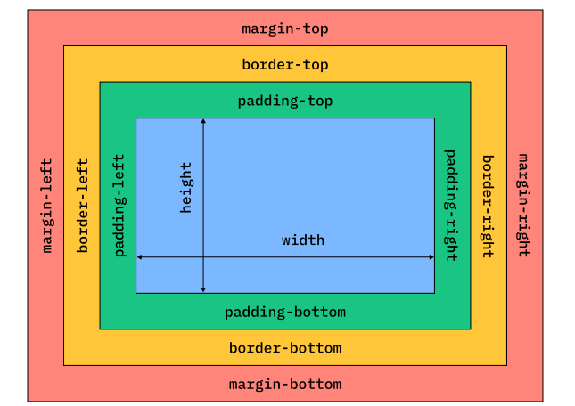

Ogni elemento HTML è rappresentato da un box che consiste in quattro aree principali:

- **margin**: è lo spazio esterno al box, che separa l'elemento dagli altri elementi circostanti (altre box). Il margine è trasparente e non ha un colore di sfondo.
- **border**: è la linea che circonda il box, che può avere uno stile, uno spessore e un colore specifici. Il bordo è visibile e può essere personalizzato in vari modi.
- **padding**: è lo spazio interno al box, che separa il contenuto dell'elemento dal bordo. Il padding è trasparente e non ha un colore di sfondo, ma può essere utilizzato per creare spazio intorno al contenuto all'interno del box. Il padding è importante per migliorare la leggibilità e l'estetica del contenuto, evitando che il testo o altri elementi si avvicinino troppo al bordo del box.
- **content**: è l'area in cui viene visualizzato il contenuto dell'elemento, come testo, immagini o altri elementi HTML. Il contenuto è la parte centrale del box e può essere formattato e stilizzato in vari modi. Definita dimensione intrinseca dell'elemento

I primi tre sono definiti dalle componenti `top`, `right`, `bottom` e `left` che indicano rispettivamente la distanza del margine, del bordo o del padding dal lato superiore, destro, inferiore o sinistro del box.

Si possono modificare questi parametri tramite l'uso di proprietà `longhand` o `shorthand` a seconda di quale parametro si vuole modificare. Non ha senso usare la versione corta se si vuole modificare solo uno dei parametri, mentre è più comodo usare la versione corta se si vogliono modificare più parametri contemporaneamente.

Aggiungere lo spazio può modificare il layout a seconda se lo spazio è aggiunto all'interno del box (padding) o all'esterno del box (margin). Ad esempio, se si aggiunge un margine a un elemento, questo sposterà l'elemento e gli elementi circostanti, creando più spazio tra di loro. Se si aggiunge un padding a un elemento, questo aumenterà la dimensione del box dell'elemento, ma non influenzerà la posizione degli elementi circostanti.

### Margin
Si possono specificare da 1 a 4 valori per il margine.

- Se si specifica un solo valore, questo verrà applicato a tutti e quattro i lati del box. Ad esempio, `margin: 20px;` applica un margine di 20 pixel a **tutti** i lati del box.
- Se si specificano due valori, il primo valore verrà applicato ai lati **superiore** e **inferiore**, mentre il secondo valore verrà applicato ai lati **destro** e **sinistro**. Ad esempio, `margin: 10px 20px;` applica un margine di 10 pixel ai lati superiore e inferiore, e un margine di 20 pixel ai lati destro e sinistro.
- Se si specificano tre valori, il primo valore verrà applicato al lato **superiore**, il secondo valore ai lati **destro** e **sinistro**, e il terzo valore al lato **inferiore**. Ad esempio, `margin: 10px 20px 30px;` applica un margine di 10 pixel al lato superiore, un margine di 20 pixel ai lati destro e sinistro, e un margine di 30 pixel al lato inferiore.
- Se si specificano quattro valori, questi verranno applicati rispettivamente ai lati **superiore**, **destro**, **inferiore** e **sinistro**. Ad esempio, `margin: 10px 20px 30px 40px;` applica un margine di 10 pixel al lato superiore, un margine di 20 pixel al lato destro, un margine di 30 pixel al lato inferiore, e un margine di 40 pixel al lato sinistro.

Accetta come valori `px`, `em`, `rem`, `%` e altri valori di lunghezza. Se si specifica un valore negativo, il margine si sovrapporrà agli elementi circostanti, creando un effetto di sovrapposizione. La `%` è relativa alla dimensione del contenitore genitore, quindi se si imposta `margin: 10%;`, il margine sarà pari al 10% della larghezza del contenitore genitore. Si può anche assegnare `margin: 0 auto;`: è la versione abbreviata con due valori, dove il primo valore `0` si applica ai lati superiore e inferiore, mentre il secondo valore `auto` si applica ai lati destro e sinistro. Questo è un modo comune per centrare un elemento orizzontalmente all'interno del suo contenitore genitore, poiché `auto` distribuisce equamente lo spazio rimanente a destra e a sinistra dell'elemento. Il box viene centrato solo quando è disponibile dello spazio in orizzontale.

Se a una scatola non viene definita una larghezza specifica, il margine destro e sinistro si espanderanno per occupare tutto lo spazio disponibile, centrandola automaticamente. Se invece viene definita una larghezza specifica, il margine destro e sinistro si espanderanno per occupare lo spazio rimanente, ma la scatola non sarà centrata.

#### Collasso dei margini
Il collasso dei margini è un comportamento in cui i margini verticali di elementi adiacenti si combinano in un unico margine, invece di sommarsi. Questo accade quando due o più elementi hanno margini verticali che si toccano o si sovrappongono. In questo caso, il margine risultante sarà pari al margine più grande tra quelli coinvolti, invece di essere la somma dei margini. Ad esempio, se un elemento ha un margine inferiore di 20 pixel e l'elemento adiacente ha un margine superiore di 30 pixel, il margine risultante tra i due elementi sarà di 30 pixel, non di 50 pixel. Il collasso dei margini si verifica solo con i margini verticali (superiore e inferiore) e non con i margini orizzontali (destro e sinistro).

In caso responsive il collasso dei margini può essere utile per evitare spazi eccessivi tra gli elementi quando la larghezza del viewport si riduce, mantenendo un layout più compatto e leggibile su dispositivi mobili. Tuttavia, è importante testare attentamente il design su diverse dimensioni di schermo per assicurarsi che il collasso dei margini non causi problemi di sovrapposizione o spaziatura indesiderata tra gli elementi.

### Padding
Il padding controlla lo spazio all'interno del bordo del box. Serve a separare il contenuto dal bordo. L'elemento di bg si estende anche attraverso lo spazio del padding e non solo del content. Per dimensionare questo spazio si usano le stesse unità di misura del margin. Il padding non influisce sulla posizione degli elementi circostanti, ma aumenta la dimensione complessiva del box, poiché il padding viene aggiunto alla dimensione del contenuto. Unica eccezione è `auto` o `valori negativi` in quanto si ridurrebbe il valore del contenuto e questo non ha senso.

### Border
Il bordo è la linea che circonda il box e può essere personalizzato in vari modi. Le proprietà principali per definire un bordo includono:

- `border-width`: specifica lo spessore del bordo (ad esempio, `1px`, `2px`, ecc.).
- `border-style`: specifica lo stile del bordo (ad esempio, `solid`, `dashed`, `dotted`, `double`, ecc.).
- `border-color`: specifica il colore del bordo (ad esempio, `red`, `#ff0000`, `rgb(255, 0, 0)`, ecc.).

Si può anche utilizzare la proprietà `border` in versione shorthand per specificare tutte e tre le proprietà del bordo in una sola dichiarazione, ad esempio, `border: 2px solid red;` definisce un bordo spesso 2 pixel, con stile solido e colore rosso. Il bordo viene disegnato all'interno del box, quindi non influisce sulla dimensione complessiva del box, ma può influire sulla posizione degli elementi circostanti se il bordo è abbastanza spesso da occupare spazio significativo.

Si può anche specificare un solo bordo o diverse proprietà per ogni lato del box utilizzando le proprietà `border-top`, `border-right`, `border-bottom` e `border-left`. 

La proprietà `border-radius` consente di creare bordi arrotondati per un elemento, specificando il raggio di curvatura degli angoli del box. Ad esempio, `border-radius: 10px;` applica un raggio di curvatura di 10 pixel a tutti e quattro gli angoli del box, creando un effetto di arrotondamento uniforme. È possibile specificare valori diversi per ogni angolo utilizzando la sintassi `border-radius: top-left top-right bottom-right bottom-left;`, ad esempio, `border-radius: 10px 20px 30px 40px;` applica un raggio di curvatura di 10 pixel all'angolo in alto a sinistra, 20 pixel all'angolo in alto a destra, 30 pixel all'angolo in basso a destra e 40 pixel all'angolo in basso a sinistra.

#### Outline
È una linea disegnata all'esterno del bordo del box, non influisce sulla dimensione complessiva e non appartiene al layer del box non influendo la posizione degli elementi circostanti. Può essere utile per evidenziare un elemento selezionato senza modificare il layout della pagina.

Spesso viene usato per evidenziare un elemento quando riceve il focus ad esempio da tastiera (selezioni un tasto con tab etc.). Può essere anche comodo spostare la linea disegnata dal bordo del box usando la proprietà `outline-offset`, ad esempio, `outline-offset: 5px;` sposta l'outline di 5 pixel verso l'esterno del bordo del box, creando uno spazio tra il bordo e l'outline.

#### Overflow
Quando una box ha un contenuto che supera le sue dimensioni, si verifica un overflow. La proprietà `overflow` controlla come gestire questo contenuto in eccesso. I valori comuni includono:
- `visible` (valore di default): Il contenuto in eccesso viene visualizzato oltre i confini della box, senza alcuna restrizione.
- `hidden`: Il contenuto in eccesso viene nascosto e non è visibile.
- `scroll`: Vengono aggiunte barre di scorrimento alla box, consentendo all'utente di scorrere per vedere il contenuto in eccesso.
- `auto`: Vengono aggiunte barre di scorrimento solo se il contenuto in eccesso supera le dimensioni della box, altrimenti il contenuto viene visualizzato normalmente senza barre di scorrimento.

L'overflow può essere gestito separatamente per l'asse orizzontale e verticale utilizzando le proprietà `overflow-x` e `overflow-y`. Ad esempio, `overflow-x: hidden;` nasconde il contenuto in eccesso solo sull'asse orizzontale, mentre `overflow-y: scroll;` aggiunge una barra di scorrimento solo sull'asse verticale.

---
La dimensione `auto` per la `width` o `height` di un elemento lascia che il browser calcoli automaticamente la dimensione in base al contenuto e al contesto del layout. Se un elemento ha una dimensione `auto`, la sua larghezza o altezza si adatterà dinamicamente al contenuto che contiene e al contenitore, espandendosi o contraendosi per adattarsi al testo, alle immagini o ad altri elementi all'interno di esso. Questo comportamento è utile per creare layout flessibili e adattabili, poiché consente agli elementi di ridimensionarsi in modo naturale in base al loro contenuto e alla disponibilità di spazio nel layout complessivo della pagina.

## Box-sizing e il calcolo delle dimensioni
La proprietà box-sizing è fondamentale in CSS perché determina come vengono calcolate le dimensioni finali di un elemento (larghezza e altezza), decidendo se includere o escludere lo spazio occupato da padding e bordi.

- `content-box` (Comportamento di default): Le dimensioni specificate con width e height si applicano esclusivamente al contenuto dell'elemento.

Esempio: Se imposti `width: 200px;`, un padding di `20px`	 e un `border` di `5px`, la larghezza visiva totale dell'elemento sullo schermo sarà di `250px` (`200px` di contenuto + `20px` di padding sinistro + `20px` di padding destro + `5px` di bordo sinistro + `5px` di bordo destro). Questo comportamento rende molto difficile calcolare gli ingombri esatti nei layout a griglia.

- `border-box` (Comportamento raccomandato): Le dimensioni specificate per width e height includono automaticamente il padding e il bordo.

Esempio: Impostando `width: 200px;` con `box-sizing: border-box;`, l'elemento avrà una larghezza totale rigida di `200px`. Sarà il browser a "sottrarre" internamente lo spazio per il padding e il bordo, restringendo dinamicamente l'area dedicata al contenuto testuale. Questo rende la creazione di layout complessi estremamente più semplice e prevedibile.

## Card Design
Una Card è un pattern di design della User Interface (UI) utilizzato per presentare informazioni eterogenee ma correlate (immagini, testi, bottoni) in modo compatto, organizzato e visivamente separato dal resto della pagina. Le card sono lo standard per blog, portfolio, e-commerce e dashboard.

Solitamente, una card viene strutturata semanticamente utilizzando il tag `<article>` ed è divisa in tre sezioni principali:

- `Header` (Titolo/Immagine): Spesso contiene un elemento di intestazione (`<h2>, <h3>`) che descrive il contenuto, oppure l'immagine principale (thumbnail).

- `Body` (Corpo): Il nucleo della card. Contiene il testo descrittivo, brevi riassunti o altri contenuti multimediali. Spesso richiede bordi interni (padding) o separatori (come border-top o hr) per distanziare il testo dalle altre sezioni.

- `Footer` (Piè di pagina): Include metadati (data di pubblicazione, nome dell'autore) o le azioni (bottoni "Leggi di più", icone social).

Visivamente, le card si distinguono dallo sfondo grazie all'uso di:

- Bordi sottili o angoli arrotondati (border-radius).
- Ombreggiature leggere (box-shadow) per dare un senso di profondità.
- Cambi di colore di sfondo.

La tipografia gioca un ruolo cruciale: attraverso l'uso di dimensioni del font, pesi (grassetto, normale) e colori (es. grigio scuro per i titoli, grigio chiaro per le date), l'utente deve intuire immediatamente la gerarchia visiva delle informazioni senza dover leggere tutto.

## Riarrangiare i Box
Il posizionamento e il flusso degli elementi nella pagina sono governati dalla proprietà display. CSS fornisce sia valori "classici" per il flusso normale del documento, sia sistemi di layout moderni e bidimensionali come Flexbox (`display: flex;`) e Grid (`display: grid;`).

I valori classici del display determinano il comportamento base degli elementi HTML:

- `block`: L'elemento si comporta come un blocco solido. Occupa forzatamente il 100% della larghezza del suo contenitore genitore e "rompe" il flusso, iniziando e terminando sempre su una nuova riga (es. `<div>, <p>, <h1>`). Può avere width e height personalizzate.

- `inline`: L'elemento scorre insieme al testo. Occupa solo l'ingombro orizzontale necessario al suo contenuto e non va mai a capo forzatamente (es. `<a>, <span>, <strong>`). Nota fondamentale: agli elementi puramente inline non è possibile applicare proprietà come width, height o margini verticali.

- `inline-block`: Un ibrido potente. Si posiziona affiancato ad altri elementi come un elemento inline (senza andare a capo), ma accetta le proprietà fisiche tipiche dei blocchi, permettendo di definire esplicitamente width, height, margin e padding.

- `none`: L'elemento scompare completamente dal render della pagina e non occupa più alcuno spazio fisico, a differenza di `visibility: hidden;` che lo rende invisibile ma ne preserva l'ingombro.

### Cambiare il Display di default
Ogni tag HTML nasce con un display di default, ma è prassi comune modificarlo tramite CSS per scopi di usabilità:

Da `inline` a `inline-block` o `block` (L'esempio del Link): Di default, il tag `<a>` è inline. Questo significa che solo il testo scritto è fisicamente cliccabile. Su dispositivi mobile, cliccare una singola parola può essere difficile. Cambiando il display del link in inline-block o block, possiamo assegnargli un padding e una width. In questo modo, espandiamo a dismisura l'"area cliccabile" (la hitbox), trasformando un semplice link testuale in un comodo bottone touch-friendly.

Da `block` a `inline-block` o `inline`: Se abbiamo una serie di liste `<ul>` con elementi `<li>` (che sono `block` di default) e vogliamo creare un menu di navigazione orizzontale, cambiare il loro display in `inline-block` ci permette di affiancarli tutti sulla stessa riga.

Nei Layout Moderni è vitale comprendere come funzionano l'ereditarietà e l'influenza nei layout moderni come Flexbox e CSS Grid:

Quando dichiari display: `flex;` o `display: grid;` su un elemento, stai trasformando solo quell'elemento in un `Container` (contenitore).

Le regole di allineamento e distribuzione dello spazio offerte da `Flex/Grid` si applicano esclusivamente e rigorosamente ai figli diretti (First-level children o Flex/Grid Items).

I "nipoti" sono esclusi: Se un contenitore `Flex` ha un figlio `<div>`, e quel figlio contiene al suo interno un paragrafo `<p>`, il paragrafo non è un elemento `Flex`. Il paragrafo seguirà il normale flusso `block` all'interno del suo genitore.

Soluzione (Nesting): Se hai bisogno che anche gli elementi interni godano delle proprietà di layout flessibile, devi trasformare a sua volta l'elemento figlio in un contenitore. In CSS è assolutamente normale avere un genitore `display: flex;` il cui figlio è, a sua volta, un contenitore `display: flex;` o `display: grid;`.

## Strategie di layout
Bisogna iniziare con il flow normale del documento, che è verticale. Se si vuole disporre gli elementi in orizzontale, bisogna modificare il loro display.

Si modifica il display di un singolo elemento quando si vuole disporre solo quello in un certo modo, mentre si modifica il display di un contenitore quando si vuole disporre tutti i suoi figli in un certo modo.

- `flexbox` quando il contenuto è principalmente lineare (una dimensione prevalente, orizzontale o verticale) e si desidera un controllo preciso sull'allineamento, la distribuzione dello spazio e l'ordine degli elementi. Utile tipo per: toolbars, navigation bars, card layout, form layout, ecc.
- `grid` quando il layout è bidimensionale (sia righe che colonne) e si desidera un controllo completo sulla posizione degli elementi in entrambe le dimensioni, con la possibilità di creare layout complessi e asimmetrici.
- `positioning` quando si desidera posizionare un elemento in modo assoluto o relativo rispetto al suo contenitore o alla finestra del browser, indipendentemente dal flusso normale del documento.

Ci sono degli attributi che variano se si sta lavorando con un `container` o con un `item`:

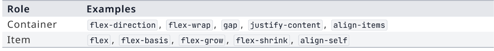

Flexbox usa un asse principale e un cross axis (ortogonale), mentre Grid usa un asse verticale e uno orizzontale. Per questo motivo, alcuni attributi di allineamento hanno nomi diversi a seconda del layout usato.

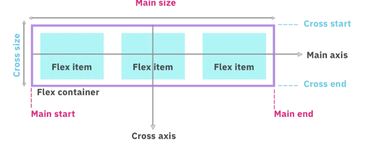

### Flex-direction
Controlla la direzione dell'asse principale in un layout Flexbox. I valori comuni includono:

- `row` (valore di default): Gli elementi vengono disposti in una riga
- `row-reverse`: Gli elementi vengono disposti in una riga, ma in ordine inverso (da destra a sinistra).
- `column`: Gli elementi vengono disposti in una colonna (da alto a basso).
- `column-reverse`: Gli elementi vengono disposti in una colonna, ma in ordine inverso (da basso a alto).

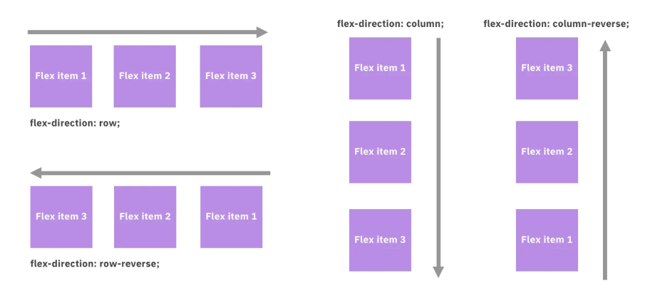

### Flex-wrap
Controlla se gli elementi in un layout Flexbox devono andare a capo quando non c'è abbastanza spazio lungo l'asse principale. I valori comuni includono: 

- `nowrap` (valore di default): Gli elementi rimangono su una sola riga o colonna, anche se ciò significa che si sovrappongono o escono dal contenitore.
- `wrap`: Gli elementi vanno a capo su più righe o colonne se non c'è abbastanza spazio lungo l'asse principale.
- `wrap-reverse`: Gli elementi vanno a capo su più righe o colonne, ma in ordine inverso (le nuove righe o colonne vengono aggiunte sopra o a sinistra delle precedenti).

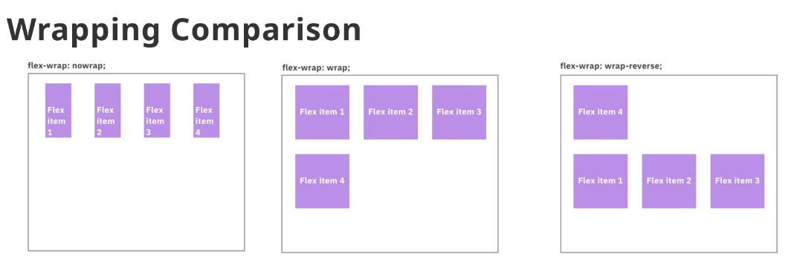

### Gap
Controlla lo spazio tra gli elementi in un layout Flexbox o Grid. Si possono distinguere i valori per `row-gap` (spazio tra le righe) e `column-gap` (spazio tra le colonne), oppure usare la sintassi shorthand `gap` per specificare entrambi i valori contemporaneamente. 

### Justify-content
Proprietà che controlla l'allineamento degli spazi lungo l'asse principale quando ne avanza. I valori comuni includono:

- `flex-start` (valore di default): Gli elementi vengono allineati all'inizio dell'asse principale.
- `flex-end`: Gli elementi vengono allineati alla fine dell'asse principale.
- `center`: Gli elementi vengono centrati lungo l'asse principale.
- `space-between`: Gli elementi vengono distribuiti lungo l'asse principale con spazi uguali tra di loro, ma senza spazio all'inizio o alla fine.
- `space-around`: Gli elementi vengono distribuiti lungo l'asse principale con spazi uguali intorno a ciascun elemento, inclusi all'inizio e alla fine.
- `space-evenly`: Gli elementi vengono distribuiti lungo l'asse principale con spazi uguali tra di loro, inclusi all'inizio e alla fine.

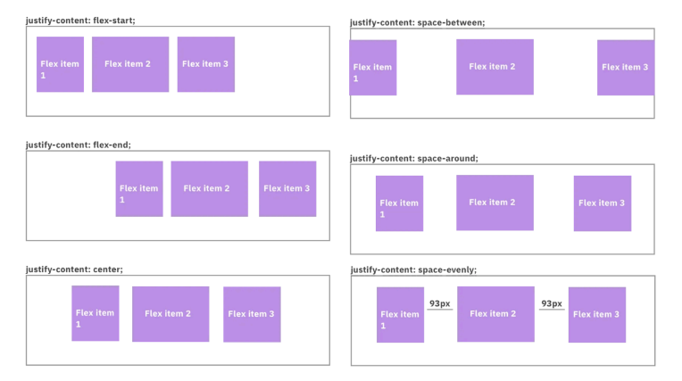

### Align-items
Controlla l'allineamento degli elementi lungo l'asse trasversale (cross axis). 

- `stretch` (valore di default): Gli elementi si allungano per riempire l'intero spazio disponibile lungo l'asse trasversale.
- `flex-start`: Gli elementi vengono allineati all'inizio dell'asse trasversale.
- `flex-end`: Gli elementi vengono allineati alla fine dell'asse trasversale.
- `center`: Gli elementi vengono centrati lungo l'asse trasversale.
- `baseline`: Gli elementi vengono allineati lungo la loro linea di base (baseline), che è la linea immaginaria su cui si "siedono" la maggior parte delle lettere (come a, b, c, A, B). Questo è particolarmente utile quando si hanno elementi di dimensioni o font diversi, poiché garantisce che il testo all'interno degli elementi si allinei in modo naturale e armonioso, mantenendo la coerenza visiva e la leggibilità.

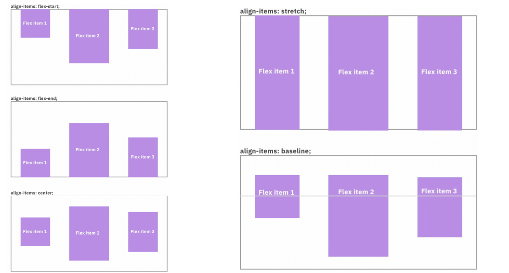

#### Align-self
Permette di cambiare un elemento unico all'interno di un layout Flexbox, sovrascrivendo l'allineamento definito da `align-items` per quel singolo elemento. 

#### Align-content
Un contenitore flex può contenere più righe o colonne di elementi. `align-content` controlla l'allineamento di queste righe o colonne lungo l'asse trasversale quando c'è spazio extra disponibile. I valori comuni includono:

- `stretch` (valore di default): Le righe o colonne si allungano per riempire l'intero spazio disponibile lungo l'asse trasversale.
- `flex-start`: Le righe o colonne vengono allineate all'inizio dell'asse trasversale.
- `flex-end`: Le righe o colonne vengono allineate alla fine dell'asse trasversale.
- `center`: Le righe o colonne vengono centrati lungo l'asse trasversale.
- `space-between`: Le righe o colonne vengono distribuite lungo l'asse trasversale con spazi uguali tra di loro, ma senza spazio all'inizio o alla fine.
- `space-around`: Le righe o colonne vengono distribuite lungo l'asse trasversale con spazi uguali intorno a ciascun elemento, inclusi all'inizio e alla fine.
- `space-evenly`: Le righe o colonne vengono distribuite lungo l'asse trasversale con spazi uguali tra di loro, inclusi all'inizio e alla fine.

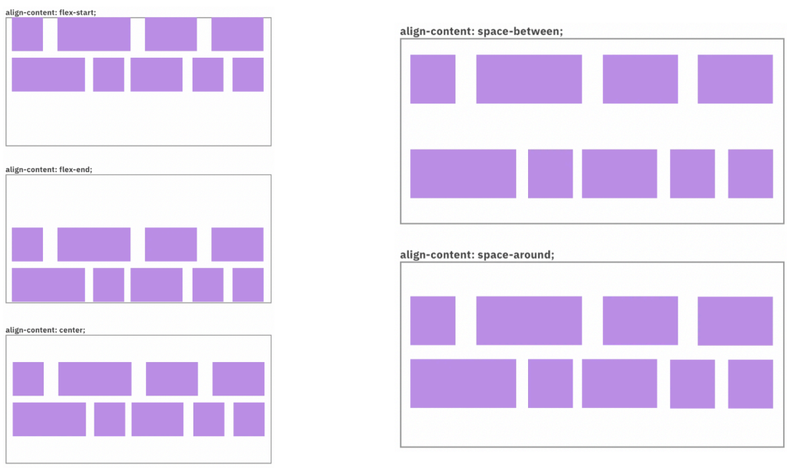

### Flex
Controlla la crescita, la contrazione e la dimensione di base degli elementi in un layout Flexbox. La sintassi è `flex: grow shrink basis;`, dove:

- `grow` (valore predefinito: 0): Indica quanto un elemento può crescere rispetto agli altri elementi flessibili quando **c'è spazio extra** disponibile lungo l'asse principale. Un valore di 0 significa che l'elemento non crescerà, mentre un valore maggiore di 0 indica che l'elemento può crescere in proporzione al suo valore rispetto agli altri elementi flessibili.
- `shrink` (valore predefinito: 1): Indica quanto un elemento può contrarsi quando lo spazio disponibile lungo l'asse principale è **insufficiente**. Un valore di 1 significa che l'elemento può contrarsi, mentre un valore di 0 indica che l'elemento non si contrarrà.
- `basis` (valore predefinito: auto): Specifica la dimensione di base dell'elemento prima che venga distribuito lo spazio extra o ridotto. Può essere un valore di lunghezza (ad esempio, `200px`) o `auto`, che indica che la dimensione di base è determinata dal contenuto dell'elemento.
Ad esempio, `flex: 1 0 200px;` indica che l'elemento ha una dimensione di base di 200 pixel, può crescere per occupare spazio extra disponibile, ma non si contrarrà se lo spazio è insufficiente. Se invece si imposta `flex: 0 1 auto;`, l'elemento non crescerà, ma si contrarrà se lo spazio è insufficiente, e la sua dimensione di base sarà determinata dal contenuto.

#### Toolbar
Flexbox diventa particolarmente utile quando un componente ha delle regioni di layout. Ad esempio, una toolbar con un logo a sinistra, un menu di navigazione al centro e dei bottoni a destra. In questo caso, si può impostare `display: flex;` sulla toolbar e utilizzare `justify-content: space-between;` per distribuire equamente lo spazio tra le tre regioni, mantenendo il logo a sinistra, il menu al centro e i bottoni a destra. Questo approccio semplifica notevolmente la creazione di layout complessi e adattabili, garantendo che gli elementi all'interno della toolbar siano posizionati in modo coerente e visivamente equilibrato. Oltre a ciò le toolbar contengono spesso le 3 regioni principali:

- `title`: Spesso posizionata a sinistra, contiene il logo o il nome dell'applicazione.
- `navigation group`: Posizionata al centro, contiene i link di navigazione principali.
- `actions`: Posizionata a destra, contiene i bottoni per le azioni principali (ad esempio, login, ricerca, ecc.).

```css
.site-title{
	flex: 0 0 auto; /* Non cresce, non si contrae, dimensione di base determinata dal contenuto */
	margin: 0; /* Rimuove il margine predefinito del titolo */
	font-size: 1.5rem; /* Aumenta la dimensione del font per il titolo */
}

.nav-links {flex : 1; } /* Cresce per occupare lo spazio disponibile, non si contrae, dimensione di base determinata dal contenuto */

.action-link {
	flex: 0 0 auto; /* Non cresce, non si contrae, dimensione di base determinata dal contenuto */
	font-weight: 700; /* Rende il testo dei bottoni più evidente */
}
```

`flex: 1;` rende flessibile gli elementi della navigazione, permettendo loro di espandersi per occupare tutto lo spazio disponibile tra il titolo e i bottoni che hanno una dimensione di base determinata dal contenuto, garantendo così un layout bilanciato e adattabile a diverse dimensioni di schermo.

Per avere i bottoni centrati nello spazio riservato alla navigazione, si può usare `justify-content: center;` sulla classe `.nav-links`, in questo modo i link di navigazione saranno centrati all'interno dello spazio disponibile tra il titolo e i bottoni, creando un layout più equilibrato e visivamente piacevole.

#### Order (evitare di usarla)
Permette di modificare gli elementi dentro flexbox senza cambiare l'ordine nel codice HTML. Ogni elemento flessibile ha una proprietà `order` che accetta un valore numerico (intero). Gli elementi vengono disposti in ordine crescente in base al valore di `order`. L'elemento con il valore più basso viene posizionato per primo, seguito dagli elementi con valori più alti. Se due o più elementi hanno lo stesso valore di `order`, vengono posizionati nell'ordine in cui appaiono nel codice HTML. Ad esempio, se si ha un layout con tre elementi flessibili e si assegna `order: 2;` al primo elemento, `order: 1;` al secondo elemento e `order: 3;` al terzo elemento, l'ordine di visualizzazione sarà:

1. Secondo elemento (order: 1)
2. Primo elemento (order: 2)
3. Terzo elemento (order: 3)

### Grid
Serve a creare un layout bidimensionale a righe e colonne (griglia). I figli diretti diventano grid items e si posizionano in base a linee verticali (colonne) e orizzontali (righe). Le proprietà principali includono:

- `grid-template-columns`: Definisce la struttura delle colonne della griglia. 

L'unità di misura più comune è `fr` (fractional unit), che rappresenta una frazione dello spazio disponibile. Ad esempio, `grid-template-columns: 1fr 2fr;` crea due colonne, dove la prima occupa un terzo dello spazio disponibile e la seconda occupa due terzi.

 L'attributo `repeat()` è una funzione che consente di semplificare la definizione di colonne o righe ripetitive. Ad esempio, `grid-template-columns: repeat(3, 1fr);` crea tre colonne di uguale larghezza, ognuna occupando un terzo dello spazio disponibile. Si possono anche combinare unità di misura diverse, ad esempio, `grid-template-columns: 200px 1fr;` crea una colonna fissa di 200 pixel e una colonna flessibile che occupa il resto dello spazio disponibile.

`autofit` e `minmax()` sono due funzioni avanzate che consentono di creare layout più dinamici e adattabili. `autofit` consente di creare un numero variabile di colonne o righe in base allo spazio disponibile, mentre `minmax()` consente di specificare una dimensione minima e massima per le colonne o righe, garantendo che si adattino in modo flessibile a diverse dimensioni dello schermo. Ad esempio, `grid-template-columns: repeat(auto-fit, minmax(200px, 1fr));` crea un layout che si adatta automaticamente, creando colonne di almeno 200 pixel di larghezza, ma che possono espandersi fino a occupare tutto lo spazio disponibile se necessario.
- `grid-template-rows`: Definisce la struttura delle righe della griglia.
- `grid-gap` o `gap`: Controlla lo spazio tra le righe e le colonne della griglia.
- `grid-template-areas`: Permette di nominare le aree della griglia per un posizionamento più intuitivo degli elementi.
Ad esempio, `grid-template-areas: "header header header" "sidebar content content" "footer footer footer";` definisce una griglia con tre aree: `header`, `sidebar`, `content` e `footer`. Gli elementi possono essere posizionati in queste aree usando la proprietà `grid-area`. Ad esempio, `grid-area: header;` posiziona un elemento nell'area denominata `header`.

Se il layout aumenta di dimensioni, le righe e le colonne si espandono per occupare lo spazio extra, mantenendo le proporzioni definite dalle unità di misura (ad esempio, `fr`) o dalle dimensioni specificate e rientrano nella regione semantica finale.
- `grid-column` e `grid-row`: Permettono di posizionare un elemento specificando le linee di inizio e fine per colonne e righe. Si specificano nel seguente modo: `grid-column: start / end;` e `grid-row: start / end;`, dove `start` e `end` sono i numeri delle linee della griglia. Ad esempio, `grid-column: 1 / 3;` posiziona un elemento che inizia alla prima linea di colonna e termina alla terza linea di colonna, occupando quindi due colonne. (analogo per le righe)

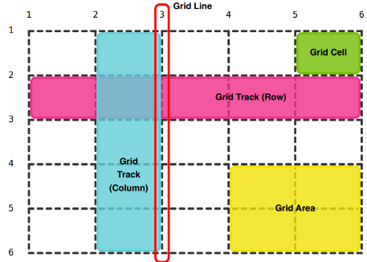


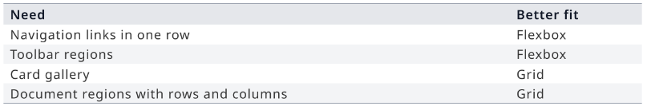

## Layout responsive
L’evoluzione delle interfacce web moderne richiede un approccio architetturale che garantisca la perfetta fruibilità dei contenuti indipendentemente dalle dimensioni dello schermo. Questo paradigma si fonda su due pilastri fondamentali: la riorganizzazione strutturale tramite le Media Query (con approccio `Mobile-First`) e il controllo granulare degli ingombri (Media Responsivi e Posizionamento assoluto).

Molti framework CSS consolidati (come Bootstrap) adottano nativamente una strategia responsiva `Mobile-First`. L'approccio `Mobile-First` impone un cambio di mentalità: si progetta e si scrive il codice CSS partendo dallo schermo più piccolo e stretto possibile (lo smartphone), garantendo innanzitutto la leggibilità del contenuto.

Solo in un secondo momento, tramite le `Media Query` (`@media`), si introducono breakpoint (punti di rottura) progressivi che, all'aumentare della larghezza del viewport, arricchiscono il layout disponendolo su più colonne.

Nel codice HTML si assegnano classi multiple allo stesso elemento per definire il suo comportamento a diverse larghezze:

```HTML
<div class="row">
    <article class="col-12 col-md-6 col-lg-4">Card</article>
</div>
```

- `col-12`: Su schermi piccoli, l'elemento occupa 12 colonne su 12 (larghezza 100%, disposizione verticale). Questa è la regola base.
- `col-md-6`: Su schermi medi, una Media Query interviene e dice all'elemento di occupare 6 colonne (larghezza 50%, due elementi affiancati).
- `col-lg-4`: Su schermi larghi, un'ulteriore Media Query porta l'ingombro a 4 colonne (larghezza 33%, tre elementi affiancati).

Per implementare questo pattern senza framework, la struttura CSS deve apparire così:

```CSS
/* Layout Base (Mobile-First): colonna singola per viewport stretti */
.feature-card {
    display: grid;
    gap: 1rem;
}

/* Breakpoint per schermi più larghi */
@media (min-width: 720px) {
    .feature-card {
        /* Il layout passa da una a due colonne. 
           La prima (immagine) fissa a 180px, la seconda (testo)
		   flessibile (1fr) */
        grid-template-columns: 180px 1fr;
    }
}
```
L'effetto pratico è che sotto i `720px` la card è impaginata verticalmente, mentre superata quella soglia l'immagine scivola nella prima colonna di sinistra e il testo nella colonna di destra.

Un layout fluido è inutile se le immagini o i video in esso contenuti hanno dimensioni rigide, poiché tenderebbero a fuoriuscire ("overflow") dal loro contenitore distruggendo la pagina. Il loro ingombro intrinseco è spesso superiore allo spazio disponibile.

Per governare le immagini si utilizzano due strategie principali, a seconda della necessità del componente:

- `Immagini Fluide` (Fluid Images)
Si usano quando l'intero contenuto visivo dell'immagine è importante e non deve mai essere tagliato. L'immagine scala in modo proporzionale insieme al suo contenitore.

```CSS
img, video {
    max-width: 100%; /* Impedisce all'immagine di allargarsi
						oltre il contenitore */
    height: auto;    /* Mantiene le proporzioni originali,
						prevenendo lo schiacciamento */
}
```	

- `Cornici Stabili` (Framed Media)
Alcuni componenti (come le gallerie di card) richiedono che l'immagine mantenga sempre una forma rigorosa e un ingombro prevedibile, per non "sfalsare" le altezze delle card vicine.
In questo caso si impone una proporzione fissa usando `aspect-ratio` e si controlla il riempimento con `object-fit`:

```CSS
.card-img {
    width: 100%;
    aspect-ratio: 16 / 9; /* Forza una cornice rettangolare 
							 panoramica */
    object-fit: cover;    /* Riempie tutta la cornice, tagliando
	 						 (crop) i bordi eccedenti */
}
```
`object-fit` accetta diversi valori, ma i più comuni sono:

- `cover`: È l'ideale quando l'omogeneità visiva del componente è più importante della visibilità totale della foto. Riempie la cornice tagliando l'eccesso.
- `contain`: Assicura che la foto non venga mai tagliata, ma può lasciare delle bande vuote (spazio bianco) ai lati se la proporzione dell'immagine non combacia con la proporzione della cornice.

### Il Posizionamento e i Livelli (position)
Mentre Flexbox e Grid gestiscono la struttura macroscopica della pagina, la proprietà position interviene per risolvere problemi di collocazione specifica, come inserire un "badge" nell'angolo di una card, bloccare un menu in alto o creare tooltip sovrapposti.

Il valore di default per tutti gli elementi è `position: static` (il normale flusso della pagina). Modificando questo valore, si altera radicalmente il comportamento del box. Da notare che gli elementi "posizionati" abilitano l'uso delle coordinate fisiche: `top, right, bottom, left`.

#### Le modalità di posizionamento:

- `position: relative` (Riferimento Locale): L'elemento rimane nel normale flusso del documento e conserva il suo spazio originale. Tuttavia, le coordinate (es. top: 10px) lo sposteranno visivamente rispetto alla sua posizione naturale. Uso accademico primario: Viene quasi sempre assegnato a un contenitore genitore (es. la `.card`) per trasformarlo in un sistema di riferimento chiuso per i suoi figli.
- `position: absolute` (Sovrapposizione Locale): L'elemento viene letteralmente "strappato" dal normale flusso della pagina; gli altri elementi si disporranno come se non esistesse più. Si posiziona usando le coordinate basandosi sul suo parente più prossimo che abbia una posizione diversa da static.
- `position: fixed` (Ancoraggio al Viewport): L'elemento viene rimosso dal flusso e ancorato indissolubilmente allo schermo. Non scorrerà mai quando l'utente fa scroll. (Es. pulsanti "Torna in cima" o menu di navigazione globali).
`position: sticky` (Posizionamento Misto): Inizia comportandosi come un normale elemento static o relative, ma non appena la pagina scorre oltre una certa soglia (es. `top: 0`), si "incolla" allo schermo comportandosi come un elemento fixed. Utile per le intestazioni di sezione.

#### Gestione delle Sovrapposizioni (z-index):
Poiché gli elementi in `absolute` o `fixed` escono dal flusso, andranno inevitabilmente a sormontare o nascondere altri elementi. Per controllare "chi sta sopra e chi sta sotto" (l'asse Z dello schermo) si utilizza la proprietà `z-index`. Valori numerici più alti portano l'elemento in primo piano rispetto a valori più bassi. Da usare con estrema parsimonia solo per sovrapposizioni intenzionali.


## Selettori
Esistono altri selettori più specifici che permettono di selezionare elementi in base a condizioni più complesse, come la posizione all'interno del DOM, lo stato dell'elemento o le sue relazioni con altri elementi. Alcuni esempi includono:

### attribute selector
Permette di selezionare elementi in base alla presenza o al valore di un attributo HTML. Ad esempio, `input[type="text"]` seleziona tutti gli elementi `<input>` che hanno un attributo `type` con il valore "text". Si possono anche utilizzare operatori per selezionare in modo più specifico, come `^=` (inizia con), `$=` (finisce con) e `*=` (contiene). Ad esempio, `a[href^="https"]` seleziona tutti i link che iniziano con "https".

### combinator selector
Permette di selezionare elementi in base alla loro relazione con altri elementi. I combinatori includono:
- `E F`: Selettore discendente, seleziona tutti gli elementi F che sono discendenti di un elemento E. Ad esempio, `div p` seleziona tutti i paragrafi che si trovano all'interno di un div.
- `E > F`: Selettore figlio, seleziona tutti gli elementi F che sono figli diretti di un elemento E. Ad esempio, `ul > li` seleziona solo gli elementi `<li>` che sono figli diretti di un `<ul>`.
- `E + F`: Selettore adiacente, seleziona l'elemento F che segue immediatamente un elemento E. Ad esempio, `h1 + p` seleziona il primo paragrafo che segue immediatamente un'intestazione `<h1>`.
- `E ~ F`: Selettore generale dei fratelli, seleziona tutti gli elementi F che sono fratelli di un elemento E, indipendentemente dalla loro posizione. Ad esempio, `h2 ~ p` seleziona tutti i paragrafi che sono fratelli di un'intestazione `<h2>`.

### pseudo-class selector
Permette di selezionare elementi in base al loro stato o alla loro posizione. Alcuni esempi comuni includono:
- `:hover`: Seleziona un elemento quando l'utente ci passa sopra con il mouse. Ad esempio, `button:hover` seleziona un pulsante quando viene hoverato.
- `:focus`: Seleziona un elemento quando riceve il focus, ad esempio da tastiera. Ad esempio, `input:focus` seleziona un campo di input quando è attivo.
- `:nth-child(n)`: Seleziona l'elemento che è il n-esimo figlio del suo genitore. Ad esempio, `li:nth-child(2)` seleziona il secondo elemento `<li>` all'interno di un elenco.
- `:first-child`: Seleziona un elemento che è il primo figlio del suo genitore. Ad esempio, `p:first-child` seleziona un paragrafo che è il primo figlio del suo contenitore.
- `:last-child`: Seleziona un elemento che è l'ultimo figlio del suo genitore. Ad esempio, `div:last-child` seleziona un div che è l'ultimo figlio del suo contenitore.
- `:not(selector)`: Seleziona tutti gli elementi che non corrispondono al selettore specificato. Ad esempio, `input:not([type="submit"])` seleziona tutti i campi di input che non sono di tipo "submit".

### pseudo-element selector
Permette di selezionare e stilizzare parti specifiche di un elemento, come la prima riga di testo o la prima lettera. Alcuni esempi comuni includono:
- `::before`: Crea un elemento virtuale prima del contenuto di un elemento. Ad esempio, `p::before` può essere usato per aggiungere un'icona o un simbolo prima del testo di un paragrafo.
- `::after`: Crea un elemento virtuale dopo il contenuto di un elemento. Ad esempio, `p::after` può essere usato per aggiungere un'icona o un simbolo dopo il testo di un paragrafo.
- `::first-letter`: Seleziona la prima lettera di un elemento. Ad esempio, `p::first-letter` può essere usato per creare un effetto di drop cap (lettera iniziale ingrandita) in un paragrafo.
- `::first-line`: Seleziona la prima riga di un elemento. Ad esempio, `p::first-line` può essere usato per applicare uno stile diverso alla prima riga di un paragrafo, come un colore o un font diverso.

## Competizione delle regole
Quando più regole CSS si applicano allo stesso elemento, il browser deve decidere quale regola ha la precedenza. Questo processo è governato da un sistema di specificità e da alcune regole di priorità. In generale, le regole più specifiche hanno la precedenza su quelle meno specifiche, e le regole dichiarate più vicine all'elemento (ad esempio, in un file CSS esterno rispetto a uno inline) hanno la precedenza su quelle dichiarate più lontano. Se due regole hanno la stessa specificità, quella dichiarata per ultima nel codice avrà la precedenza. 
Inoltre una classe ha specificità maggiore di un tag, e un id ha specificità maggiore di una classe. Ad esempio, se si ha una regola CSS che seleziona un elemento con una classe (ad esempio, `.button`) e un'altra regola che seleziona lo stesso elemento con un ID (ad esempio, `#submit-button`), la regola con l'ID avrà la precedenza sulla regola con la classe, anche se entrambe si applicano allo stesso elemento.
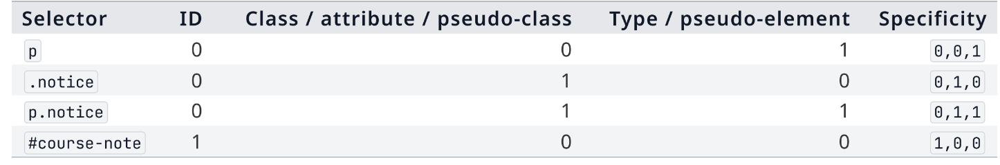

## Ereditarietà
Alcuni elementi vengono ereditati dal genitore (ad esempio, il colore del testo), mentre altri no (ad esempio, la larghezza). Se una proprietà non viene ereditata, è necessario specificarla esplicitamente per ogni elemento a cui si desidera applicarla. Ad esempio, se si desidera che tutti i paragrafi all'interno di un div abbiano un certo colore di testo, è necessario specificare `color` per ogni paragrafo, poiché questa proprietà non viene ereditata automaticamente dal `div`.

Ci sono degli attributi che ci permettono di forzare l'ereditarietà o di impedirla:

- `inherit`: Forza un elemento a ereditare il valore di una proprietà dal suo genitore, anche se quella proprietà non è normalmente ereditata. Ad esempio, `p { color: inherit; }` farà sì che i paragrafi ereditino il colore del testo dal loro genitore, anche se `color` non è una proprietà ereditata di default.
- `initial`: Resetta una proprietà al suo valore iniziale predefinito, indipendentemente dal genitore. Ad esempio, `p { color: initial; }` farà sì che i paragrafi utilizzino il colore di testo predefinito del browser, ignorando qualsiasi valore ereditato dal genitore.
- `unset`: Resetta una proprietà al suo valore ereditato se è normalmente ereditata, o al suo valore iniziale se non è normalmente ereditata. Ad esempio, `p { color: unset; }` farà sì che i paragrafi ereditino il colore del testo dal genitore se `color` è una proprietà ereditata, altrimenti utilizzeranno il colore di testo predefinito del browser.

# Javascript
Ci permette di aggiungere interattività tramite degli script che possono gestire dei dati, fare decisioni logiche, manipolare il DOM, ecc. Il codice JavaScript può essere inserito direttamente in un file HTML all'interno di un tag `<script>`, oppure può essere incluso come file esterno usando l'attributo `src` del tag `<script>`. 

Uno script è un codice che viene eseguito in un environment specifico, come un browser web o un server. In un contesto web, gli script sono spesso utilizzati per aggiungere funzionalità dinamiche a una pagina. 

Il browser decide quando uno script viene caricato e quando viene eseguito. Il browser mette a disposizione un ambiente di esecuzione per gli script, che include un insieme di API (Application Programming Interface) che gli script possono utilizzare per interagire con la pagina web e con il browser stesso. 

`console.log()` è una funzione che fa parte dell'API del browser e viene utilizzata per stampare messaggi nella console del browser. Questo è molto utile per il debug, poiché consente agli sviluppatori di vedere i valori delle variabili, i risultati delle operazioni e altri messaggi di stato durante l'esecuzione del codice JavaScript. Ad esempio, `console.log("Hello, world!");` stamperà "Hello, world!" nella console del browser.

## let e const
Usate per la dichiarazioni di variabili, `const` è usato per dichiarare variabili che non devono essere riassegnate, mentre `let` è usato per dichiarare variabili. `let` può cambiare tipo in corso d'opera. Ci sono dei tipi che si possono usare in maniera esplicita come `string`, `number`, `boolean`, `null`, `undefined`, `object` e `array`. Ad esempio, `let name: string = "Alice";` dichiara una variabile `name` di tipo stringa con il valore "Alice".

### string
Le stringhe sono sequenze di caratteri racchiuse tra virgolette. Possono essere delimitate da virgolette singole ('), virgolette doppie (") o backticks (\`). Ad esempio, `let greeting = "Hello, world!";` dichiara una stringa con il valore "Hello, world!". 

## undefined e null
`undefined` è un tipo di dato che indica che una variabile è stata dichiarata ma non ha ancora un valore assegnato. Ad esempio, `let x; console.log(x);` stamperà `undefined` perché `x` è stata dichiarata ma non inizializzata.
`null` è un tipo di dato che rappresenta l'assenza intenzionale di un valore. Ad esempio, `let y = null; console.log(y);` stamperà `null` perché `y` è stata dichiarata e assegnata il valore `null`.

### NaN
`NaN` (Not a Number) è un valore speciale che rappresenta un risultato non numerico. Si verifica quando si tenta di eseguire un'operazione matematica che non ha senso, come dividere zero per zero o convertire una stringa non numerica in un numero. Ad esempio, `let result = 0 / 0; console.log(result);` stamperà `NaN` perché la divisione di zero per zero è indefinita. NaN a discapito del nome è comunque un valore di tipo `number`.

## Truthy e Falsy
In JavaScript, i valori possono essere valutati come "truthy" o "falsy" quando vengono utilizzati in un contesto booleano, come in un'istruzione `if`. I valori "falsy" sono quelli che vengono valutati come `false` quando vengono convertiti in un booleano. I valori "truthy" sono quelli che vengono valutati come `true`. Alcuni esempi di valori "falsy" includono `false`, `0`, `""` (stringa vuota), `null`, `undefined` e `NaN`.

Per testare una condizione si usa `==` o `===`. Il primo è un confronto di uguaglianza che esegue la coercizione dei tipi, mentre il secondo è un confronto di identità che confronta sia il valore che il tipo. Ad esempio, `0 == false` restituisce `true` perché `0` viene coerentemente convertito in `false`, mentre `0 === false` restituisce `false` perché i tipi sono diversi (number vs boolean). Si tende ad usare `===` per evitare comportamenti imprevisti dovuti alla coercizione dei tipi, garantendo così un confronto più rigoroso e prevedibile.

## Inline e External Script
Si possono inserire script direttamente all'interno di un attributo HTML, come `onclick`, `onmouseover`, ecc. Ad esempio, `<button onclick="alert('Hello!')">``Click me</button>` crea un pulsante che mostra un messaggio di allerta quando viene cliccato. Tuttavia, questa pratica è generalmente sconsigliata perché mescola la logica JavaScript con la struttura HTML, rendendo il codice più difficile da mantenere e debugare. Inoltre, può rappresentare un rischio per la sicurezza (XSS) se non gestita correttamente. La cosa più sensata è usare un file esterno che viene integrato tramite il tag `<script src="path/to/script.js"></script>`, mantenendo così una chiara separazione tra struttura (HTML), stile (CSS) e comportamento (JavaScript). 

Con `defer` e `async` si può controllare quando viene eseguito uno script esterno. `defer` fa sì che lo script venga scaricato in parallelo al parsing del documento, ma la sua esecuzione avviene solo dopo che il documento è stato completamente analizzato. `async` fa sì che lo script venga scaricato in parallelo al parsing del documento e venga eseguito non appena è pronto, senza attendere il completamento del parsing (creazione del DOM). Ad esempio, `<script src="script.js" defer></script>` carica lo script in modo asincrono e lo esegue solo dopo che il documento è stato completamente analizzato, mentre `<script src="script.js" async></script>` carica lo script in modo asincrono e lo esegue non appena è pronto, indipendentemente dallo stato del parsing del documento. Non è detto che più script vengano eseguiti in ordine, dipende da quale script viene scaricato per primo. Se si ha bisogno di un ordine specifico, è meglio usare `defer` o non usare nessuno dei due attributi.

## Decisioni e Loop
Le decisioni in JavaScript vengono gestite principalmente con le istruzioni `if`, `else if` e `else`. A livello logico si usa `&&` (AND) e `||` (OR) per combinare più condizioni e `!` (NOT) per negare una condizione. Ad esempio, `if (age >= 18 && age < 65) { console.log("Adult"); }` verifica se l'età è compresa tra 18 e 65 anni, e se la condizione è vera, stampa "Adult" nella console.

`while` e `for` sono due tipi di loop in JavaScript. `while` esegue un blocco di codice finché una condizione specificata è vera. Ad esempio, `let i = 0; while (i < 5) { console.log(i); i++; }` stampa i numeri da 0 a 4 nella console. `for` è un loop più compatto che include l'inizializzazione, la condizione e l'incremento in una sola riga. Ad esempio, `for (let i = 0; i < 5; i++) { console.log(i); }` fa esattamente la stessa cosa del loop `while` precedente, stampando i numeri da 0 a 4 nella console.

## Funzioni
Per dichiarare una funzione in JavaScript si usa la parola chiave `function`, seguita dal nome della funzione, da una lista di parametri tra parentesi e da un blocco di codice racchiuso tra parentesi graffe. Ad esempio, `function greet(name) { return "Hello, " + name + "!"; }` dichiara una funzione chiamata `greet` che accetta un parametro `name` e restituisce un saluto personalizzato.
Le funzioni possono essere chiamate passando i valori dei parametri tra parentesi. Ad esempio, `console.log(greet("Alice"));` stamperà "Hello, Alice!" nella console. Le funzioni possono anche essere assegnate a variabili, passate come argomenti ad altre funzioni o restituite da altre funzioni, rendendo JavaScript un linguaggio molto flessibile e potente per la programmazione funzionale.

### Arrow Function
Si usano per trasformazioni o istruzioni di modifica brevi che tornano immediatamente il valore aggiornato come per esempio:
`const double = number => number * 2;` dichiara una funzione chiamata `double` che accetta un parametro `number` e restituisce il doppio di quel numero. Le arrow function sono particolarmente utili per funzioni anonime o come callback, poiché hanno una sintassi più concisa rispetto alle funzioni tradizionali. Ad esempio, `const numbers = [1, 2, 3]; const doubledNumbers = numbers.map(number => number * 2);` utilizza un'arrow function come callback per il metodo `map`, restituendo un nuovo array con i numeri raddoppiati.

## Dati strutturati
Gli oggetti in JavaScript sono collezioni di coppie chiave-valore, dove le chiavi sono stringhe (o simboli) e i valori possono essere di qualsiasi tipo. Ad esempio, `const person = { name: "Alice", age: 30 };` crea un oggetto `person` con due proprietà: `name` e `age`.

Gli array sono un tipo speciale di oggetto che rappresenta una lista ordinata di valori. Ad esempio, `const numbers = [1, 2, 3, 4, 5];` crea un array chiamato `numbers` contenente i numeri da 1 a 5. Gli oggetti e gli array sono fondamentali per la gestione dei dati in JavaScript e vengono utilizzati in una vasta gamma di applicazioni, dalla manipolazione del DOM alla comunicazione con server tramite API. `.length` è una proprietà che restituisce il numero di elementi in un array o il numero di caratteri in una stringa. Ad esempio, `numbers.length` restituirà `5`, mentre `"Hello".length` restituirà `5` perché la stringa "Hello" contiene 5 caratteri. Questa proprietà è molto utile per iterare su array o per verificare la lunghezza di una stringa prima di eseguire operazioni su di essa.

### Metodi utili per gli array

- `.pop()` è un metodo degli array che rimuove l'ultimo elemento dell'array e lo restituisce. 
- `.splice()` è un metodo degli array che rimuove un valore in una data posizione. 
- `.push()` è un metodo degli array che aggiunge un elemento alla fine dell'array. 
- `.includes()` è un metodo degli array che verifica se un elemento specifico è presente nell'array, restituendo `true` o `false`.

## JSON
JSON (JavaScript Object Notation) è un formato di dati leggero e facile da leggere che viene utilizzato per scambiare dati tra un server e un client. JSON rappresenta i dati come coppie chiave-valore, simili agli oggetti JavaScript, ma con una sintassi più rigorosa. Ad esempio, un oggetto JSON potrebbe essere rappresentato come `{"name": "Alice", "age": 30}`. JSON supporta anche array, ad esempio `{"numbers": [1, 2, 3, 4, 5]}`.

## Ordine di esecuzione
Il browser esegue il codice JavaScript in un ordine specifico, che dipende da come e dove viene inserito il codice. In generale, il browser esegue il codice JavaScript in ordine di apparizione nel documento HTML. Inoltre, il codice JavaScript all'interno di un tag `<script>` viene eseguito prima del caricamento completo della pagina, quindi se si tenta di accedere a elementi del DOM che non sono ancora stati caricati, si otterrà un errore. Per evitare questo problema, è possibile inserire il codice JavaScript alla fine del documento HTML, appena prima del tag di chiusura `</body>`, in modo che venga eseguito solo dopo che tutti gli elementi del DOM sono stati caricati. In alternativa, è possibile utilizzare l'evento `DOMContentLoaded` per eseguire il codice solo dopo che il DOM è stato completamente caricato, indipendentemente da dove si trova il codice nel documento. Ad esempio:

```javascript
document.addEventListener('DOMContentLoaded', function() {
    // Il codice qui all'interno verrà eseguito solo dopo che il DOM è stato completamente caricato
});
```

Si possono inserire dei `timeout` per eseguire del codice dopo un certo intervallo di tempo. Ad esempio, `setTimeout(function() { console.log("Hello, world!"); }, 2000);` esegue la funzione che stampa "Hello, world!" nella console dopo un ritardo di 2000 millisecondi (2 secondi). Questo è utile per creare effetti di temporizzazione o per eseguire del codice in modo asincrono dopo un certo periodo di tempo. 

Js usa un singolo thread per eseguire lo script principale, il codice attuale runna nello stack di chiamate. Quando del lavoro asincrono è pronto (ad esempio, una risposta da un server), viene messo in una coda. Quando lo stack è vuoto, il browser prende il primo elemento dalla coda e lo esegue. Questo meccanismo è noto come "event loop" ed è fondamentale per la gestione dell'asincronia in JavaScript, permettendo al browser di rimanere reattivo anche quando ci sono operazioni che richiedono tempo, come richieste di rete o timer.

## Manipolazione del DOM
Il DOM (Document Object Model) è una rappresentazione ad albero della struttura di un documento HTML. JavaScript può interagire con il DOM per modificare dinamicamente il contenuto, la struttura e lo stile di una pagina web. Ad esempio, `document.getElementById("myElement").textContent = "New content";` seleziona l'elemento con l'id "myElement" e ne modifica il testo interno a "New content".
Alcuni metodi comuni per selezionare elementi del DOM includono:

- `document.getElementById("id")`: seleziona un elemento in base al suo id.
- `document.getElementsByClassName("class")`: seleziona tutti gli elementi con una determinata classe.
- `document.getElementsByTagName("tag")`: seleziona tutti gli elementi con un determinato tag.
- `document.querySelector("selector")`: seleziona il primo elemento che corrisponde a un selettore CSS.
- `document.querySelectorAll("selector")`: seleziona tutti gli elementi che corrispondono a un selettore CSS. Sono restituiti degli oggetti NodeList, che sono simili agli array ma non hanno tutti i metodi degli array. Per iterare su un NodeList si può usare `forEach`, ad esempio: `document.querySelectorAll("p").forEach(p => p.style.color = "red");` seleziona tutti i paragrafi e cambia il loro colore del testo a rosso. Gli elementi della NodeList sono statici e non si aggiornano automaticamente se il DOM cambia dopo la selezione. 

Una volta selezionati gli elementi del DOM, è possibile modificarne le proprietà, aggiungere o rimuovere classi, creare nuovi elementi e inserirli nel DOM. Ad esempio, `const newElement = document.createElement("div"); newElement.textContent = "Hello!"; document.body.appendChild(newElement);` crea un nuovo elemento `<div>`, imposta il suo testo a "Hello!" e lo aggiunge alla fine del corpo del documento.

Si possono usare dei punti per le ricerche più specifiche che non partono da `document`, ma da un elemento specifico. 

### TextContent e InnerHTML
`textContent` è una proprietà che rappresenta il testo all'interno di un elemento, escludendo qualsiasi markup HTML. Ad esempio, se si ha un elemento `<div id="myDiv">Hello <strong>World</strong></div>`, `document.getElementById("myDiv").textContent` restituirà "Hello World", senza il tag `<strong>`.

`innerHTML` è una proprietà che rappresenta il contenuto HTML all'interno di un elemento, inclusi i tag HTML. Ad esempio, se si ha lo stesso elemento `<div id="myDiv">Hello <strong>World</strong></div>`, `document.getElementById("myDiv").innerHTML` restituirà `"Hello <strong>World</strong>"`, mantenendo il markup HTML.

Tutti i selettori che non trovano l'elemento desiderato restituiscono `null`, quindi è importante verificare che l'elemento esista prima di tentare di accedere alle sue proprietà o metodi, altrimenti si otterrà un errore. 

### Traversal Overview
- `parentElement` restituisce il genitore diretto di un elemento. Ad esempio, se si ha un elemento `<div id="child"><p>Text</p></div>`, `document.getElementById("child").parentElement` restituirà l'elemento `<div>` che è il genitore del paragrafo `<p>`.
- `children` restituisce una collezione di tutti gli elementi figli diretti di un elemento. Ad esempio, se si ha un elemento `<div id="parent"><p>Text</p><span>More text</span></div>`, `document.getElementById("parent").children` restituirà una collezione contenente il paragrafo `<p>` e lo span `<span>`.
- `nextElementSibling` restituisce il fratello successivo di un elemento. Ad esempio, se si ha un elemento `<div><p>First</p><p>Second</p></div>`, `document.querySelector("p").nextElementSibling` restituirà il secondo paragrafo `<p>Second</p>`.
- `previousElementSibling` restituisce il fratello precedente di un elemento. Ad esempio, se si ha un elemento `<div><p>First</p><p>Second</p></div>`, `document.querySelector("p:last-child").previousElementSibling` restituirà il primo paragrafo `<p>First</p>`.

Si tende a usare le query quando si vuole selezionare un elemento specifico mentre la navigazione del DOM è più utile quando si vuole muoversi tra elementi già selezionati, ad esempio per modificare un elemento figlio o per trovare un fratello di un elemento selezionato.

### create, append e remove

- `createElement` è un metodo che consente di creare un nuovo elemento HTML. Ad esempio, `const newDiv = document.createElement("div");` crea un nuovo elemento `<div>` che può essere successivamente modificato e inserito nel DOM.
- `append` è un metodo che consente di inserire l'elemento creato alla fine del contenitore selezionato (document o un punto intermedio).
- `remove` è un metodo che consente di rimuovere un elemento dal DOM

### Attributi 

- `setAttribute` è un metodo che consente di impostare un attributo su un elemento. Ad esempio, `element.setAttribute("class", "myClass");` imposta l'attributo `class` dell'elemento a "myClass".
- `getAttribute` è un metodo che consente di ottenere il valore di un attributo da un elemento. Ad esempio, `const classValue = element.getAttribute("class");` restituisce il valore dell'attributo `class` dell'elemento.
- `removeAttribute` è un metodo che consente di rimuovere un attributo da un elemento. Ad esempio, `element.removeAttribute("class");` rimuove l'attributo `class` dall'elemento.

### DOM Properties
Alcune attributi standard sono accessibili come proprietà del DOM. Ad esempio, `element.id` è una proprietà che rappresenta l'attributo `id` di un elemento. Se si ha un elemento `<div id="myDiv"></div>`, `document.getElementById("myDiv").id` restituirà "myDiv". Allo stesso modo, `element.className` rappresenta l'attributo `class` di un elemento. Se si ha un elemento `<div class="myClass"></div>`, `document.getElementById("myDiv").className` restituirà "myClass". Queste proprietà sono spesso più convenienti da usare rispetto ai metodi `setAttribute` e `getAttribute` per gli attributi standard, poiché consentono di accedere e modificare direttamente i valori degli attributi senza dover passare attraverso i metodi.

###	classList
`classList` è una proprietà che rappresenta la lista delle classi di un elemento come un oggetto DOMTokenList. Questo oggetto fornisce metodi utili per aggiungere, rimuovere e verificare la presenza di classi su un elemento. Ad esempio, `element.classList.add("newClass");` aggiunge la classe "newClass" all'elemento, mentre `element.classList.remove("oldClass");` rimuove la classe "oldClass" dall'elemento. Per verificare se un elemento ha una determinata classe, si può usare `element.classList.contains("className");`, che restituisce `true` se l'elemento ha la classe specificata e `false` altrimenti. `classList` è particolarmente utile per gestire dinamicamente le classi CSS di un elemento, consentendo di modificare l'aspetto e il comportamento di una pagina web in risposta a eventi o condizioni specifiche.

### dataset
`dataset` è una proprietà che rappresenta un oggetto DOMStringMap contenente tutte le coppie chiave-valore degli attributi personalizzati che iniziano con `data-` su un elemento. Ad esempio, se si ha un elemento `<div id="myDiv" data-user-id="123" data-role="admin"></div>`, `document.getElementById("myDiv").dataset` restituirà un oggetto con le proprietà `userId` e `role`, che corrispondono agli attributi `data-user-id` e `data-role`. È possibile accedere a questi valori usando la notazione a punto, ad esempio `element.dataset.userId` restituirà "123", e `element.dataset.role` restituirà "admin". Inoltre, è possibile modificare questi valori assegnando nuove stringhe alle proprietà dell'oggetto `dataset`, ad esempio `element.dataset.userId = "456";` aggiornerà l'attributo `data-user-id` dell'elemento a "456". La proprietà `dataset` è molto utile per memorizzare dati personalizzati direttamente negli elementi HTML, consentendo di associare informazioni specifiche a elementi senza dover ricorrere a strutture dati esterne.

## Eventi
Gli eventi sono azioni o accadimenti che si verificano nel browser, come un clic del mouse, la pressione di un tasto, il caricamento di una pagina o il ridimensionamento della finestra. Possono avere origine dall'utente, dal documento o dalla finestra del browser. JavaScript può ascoltare questi eventi e rispondere ad essi eseguendo del codice specifico, collegando un'azione dell'utente a una logica applicativa senza dover ricaricare la pagina.

`addEventListener(tipo, handler)` è il metodo che registra un ascoltatore: si chiama sull'elemento da osservare, il primo argomento è il tipo di evento (una stringa come `"click"`), il secondo è la funzione da eseguire quando l'evento si verifica. Ad esempio, `element.addEventListener("click", function() { console.log("Element clicked!"); });` aggiunge un listener per l'evento "click" su un elemento, e quando l'elemento viene cliccato, viene eseguita la funzione che stampa "Element clicked!" nella console. Il codice di registrazione viene eseguito subito, ma la funzione handler viene eseguita solo in seguito, quando l'evento si verifica davvero.

L'handler può anche essere scritto come funzione con nome, passando il nome della funzione (senza parentesi) come secondo argomento:

```js
function handleSaveClick() {
	console.log("Salvataggio in corso");
}
button.addEventListener("click", handleSaveClick); // corretto: passa un riferimento alla funzione
button.addEventListener("click", handleSaveClick()); // sbagliato: chiama subito la funzione e passa il suo risultato
```

`addEventListener()` si aspetta un riferimento a funzione: scrivere il nome della funzione la passa come valore, mentre aggiungere le parentesi la richiama immediatamente durante la registrazione, invece che al verificarsi dell'evento. Usare funzioni con nome (invece di funzioni anonime) rende anche più semplice la gestione dei listener: si possono registrare più listener sullo stesso elemento, e un listener può essere rimosso con `removeEventListener(tipo, handler)`, a patto di passargli lo stesso riferimento di funzione usato in fase di registrazione.

### L'oggetto evento

Il browser passa automaticamente all'handler un oggetto evento, che descrive cosa è successo e dove. Alcune proprietà utili:

- `event.type`: il tipo di evento che si è verificato (ad esempio `"click"` o `"input"`). Utile quando lo stesso handler viene riutilizzato per eventi diversi.
- `event.target`: l'elemento su cui l'evento ha avuto origine (ad esempio, per un click su un bottone, di solito è il bottone stesso).
- `event.currentTarget`: l'elemento su cui è registrato il listener che sta gestendo l'evento. Coincide spesso con `target`, ma può differire quando l'evento nasce da un elemento annidato all'interno di quello osservato (ad esempio uno `<span>` dentro un `<button>`): in quel caso `target` è l'elemento interno cliccato, `currentTarget` resta l'elemento su cui è agganciato il listener. Questa distinzione è utile soprattutto quando uno stesso handler viene condiviso da più elementi, perché permette di leggere l'elemento osservato senza dipendere da una variabile esterna.

```js
button.addEventListener("click", event => {
	console.log("Partito da:", event.target);
	console.log("Gestito da:", event.currentTarget);
});
```

Eventi diversi espongono dati diversi. Un evento `input` (che si attiva a ogni modifica del valore di un campo di testo) espone il valore corrente tramite `event.target.value`; un evento da tastiera come `keydown` o `keyup` espone il tasto premuto o rilasciato tramite `event.key`, ed è utilizzabile non solo sui form ma anche su un elemento qualsiasi o sull'intero documento:

```js
document.addEventListener("keydown", event => {
	if (event.key === "Escape") {
		chiudiPannello();
	}
});
```

### Aggiornare l'interfaccia in risposta a un evento

Un handler spesso deve aggiornare più elementi contemporaneamente per mantenere l'interfaccia coerente (ad esempio un pannello che si apre, un'etichetta del bottone che cambia, un messaggio di stato che si aggiorna). Conviene calcolare una volta il nuovo stato e usarlo per aggiornare testo e classi in modo coordinato:

```js
const isVisible = pannelloDettagli.classList.toggle("is-visible");
bottoneToggle.textContent = isVisible ? "Nascondi dettagli" : "Mostra dettagli";
messaggioStato.textContent = isVisible ? "Dettagli visibili." : "Dettagli nascosti.";
```

### Eventi dei form

I form generano eventi propri mentre l'utente modifica, sceglie e invia dati:

- `input`: si attiva a ogni modifica del valore di un campo di testo, utile per contatori, anteprime e feedback in tempo reale mentre si digita.
- `change`: si attiva quando l'utente conferma una nuova scelta (select, checkbox, radio button), non a ogni singolo carattere.
- `submit`: si attiva sul form (non sul bottone) quando l'utente tenta di inviarlo, tramite click sul pulsante o tasto Invio.

Una checkbox può abilitare un pulsante di invio tramite la proprietà `disabled`:

```js
confermaCheckbox.addEventListener("change", event => {
	bottoneInvia.disabled = !event.target.checked;
});
```

Per impostazione predefinita il submit di un form ricarica la pagina (o naviga verso l'azione del form). `event.preventDefault()`, chiamato nell'handler di `submit`, annulla questo comportamento predefinito e lascia che sia lo script a decidere cosa fare, ad esempio validare i campi prima di procedere:

```js
form.addEventListener("submit", event => {
	event.preventDefault();
	if (!validaForm()) {
		messaggioFeedback.textContent = "Controlla i campi evidenziati.";
		return;
	}
	messaggioFeedback.textContent = "La richiesta è pronta.";
});
```

`FormData` legge i valori pronti per essere inviati, associandoli al nome (`name`) di ciascun controllo del form, invece di doverli leggere singolarmente campo per campo:

```js
const formData = new FormData(form);
const email = formData.get("email");
const materiale = formData.get("materiale");
```

La validazione lato client (in JavaScript, prima dell'invio) migliora l'esperienza dando un riscontro immediato, ma non deve essere l'unico controllo: può sempre essere aggirata (ad esempio disabilitando JavaScript o inviando la richiesta con altri strumenti), quindi il server deve validare comunque i dati ricevuti — lo stesso principio si ritrova più avanti a proposito delle API REST.

# Backend

## Node.js ed Express

Fino a questo punto il codice JavaScript scritto è sempre stato eseguito nel browser, con accesso a `document`, `window` e al DOM. **Node.js** è invece un ambiente che esegue JavaScript fuori dal browser, ad esempio da terminale: fornisce API diverse, pensate per l'esecuzione lato server, come l'accesso al file system, ai processi e alla rete, ma non ha accesso a `document` o `window` (che esistono solo nel browser). È lo stesso linguaggio, ma un ambiente di esecuzione diverso, con API diverse a disposizione.

Il comando `node` esegue un file JavaScript come programma indipendente (`node server.js`), mentre **npm** (Node Package Manager), installato insieme a Node.js, gestisce le dipendenze del progetto:

- `npm init -y` crea il file `package.json` iniziale, che descrive il progetto (nome, versione, script eseguibili nella sezione `scripts`, dipendenze nella sezione `dependencies`).
- `npm install <pacchetto>` installa un pacchetto e lo registra come dipendenza; i pacchetti scaricati finiscono dentro `node_modules/`, mentre le versioni esatte installate vengono fissate in `package-lock.json`.

**Express** è un framework per Node.js che struttura la gestione delle richieste HTTP: si occupa dei dettagli ripetitivi della comunicazione HTTP, lasciando allo sviluppatore la logica specifica di ogni singola rotta.

```js
const express = require("express");
const app = express();
const port = 3000;

app.listen(port, () => {
	console.log(`Server in ascolto su http://localhost:${port}`);
});
```

`express()` crea l'oggetto applicazione, su cui si registrano rotte e regole per i file statici; `app.listen(porta, callback)` mette il server in ascolto su una porta locale (durante lo sviluppo, tipicamente `3000`) fino a quando non viene fermato da terminale (`Ctrl+C`).

`express.static("public")` espone una cartella del progetto come radice dei file serviti via HTTP: i file al suo interno (HTML, CSS, JS, immagini) vengono restituiti dal browser così come sono, senza bisogno di scrivere una rotta dedicata per ciascuno. È diverso dalle rotte dinamiche: servire un file statico non esegue logica lato server, mentre una rotta dinamica esegue codice e calcola la risposta.

```js
app.use(express.static("public"));
```

### Dal frontend al backend con `fetch()`

Il codice JavaScript nel browser non può chiamare direttamente una funzione lato server: comunica con il backend tramite richieste HTTP, inviate con `fetch()`. `fetch("/message")` invia di default una richiesta `GET` verso il path indicato (risolto rispetto all'origine del documento corrente); Express deve avere una rotta che corrisponda a quel metodo e a quel path.

`fetch()` non restituisce direttamente il corpo della risposta: restituisce una `Promise` che si risolve quando la risposta HTTP arriva. Il corpo va letto con un metodo dedicato (anch'esso asincrono), come `.text()` per testo semplice o `.json()` per dati JSON:

```js
fetch("/message")
	.then(response => response.text())
	.then(testo => {
		elementoMessaggio.textContent = testo;
	})
	.catch(() => {
		elementoMessaggio.textContent = "Il messaggio non è stato caricato.";
	});
```

`.catch()` intercetta sia problemi di rete sia errori sollevati durante l'elaborazione della risposta, evitando che l'interfaccia resti bloccata in silenzio in caso di errore.

### Rotte e risposte

Una rotta collega una richiesta in arrivo a della logica lato server: Express confronta ogni richiesta per metodo e path, ed esegue la funzione handler della rotta corrispondente.

```js
app.get("/message", (req, res) => {
	res.send("Ciao dal backend Express.");
});
```

L'handler riceve due oggetti: `req` (la richiesta ricevuta dal client) e `res` (gli strumenti per costruire la risposta). `res.send()` invia il corpo della risposta al client (Express imposta automaticamente un content-type adeguato per testo semplice).

I **codici di stato HTTP** riassumono l'esito della risposta: i codici `2xx` indicano successo, i `4xx` un problema nella richiesta del client, i `5xx` un problema lato server. `res.status(codice)` imposta il codice prima di inviare il corpo (Express usa `200 OK` di default per risposte semplici andate a buon fine):

```js
res.status(200).send("Messaggio inviato con successo.");
res.status(404).send("Messaggio non trovato.");
res.status(500).send("Errore interno del server.");
```

Una richiesta che non corrisponde a nessuna rotta definita può essere gestita con un middleware finale che risponde `404 Not Found`:

```js
app.use((req, res) => {
	res.status(404).send("Risorsa non trovata.");
});
```

Lato frontend, `fetch()` riceve comunque una risposta HTTP anche quando lo stato non è di successo: la proprietà `response.ok` permette di controllarlo prima di leggere il corpo, invece di assumere sempre che la richiesta sia andata a buon fine.

### Risposte JSON

Per messaggi semplici basta del testo, ma spesso il frontend ha bisogno di più valori collegati tra loro: `res.json()` invia un valore JavaScript (oggetto o array) come risposta JSON, impostando automaticamente il content-type corretto.

```js
app.get("/course", (req, res) => {
	res.status(200).json({
		title: "Fundamentals of Web Applications",
		topic: "Introduction to Express",
	});
});
```

Lato frontend, `response.json()` legge il corpo della risposta e lo trasforma in un oggetto o array JavaScript (anche questo passaggio è asincrono):

```js
fetch("/course")
	.then(response => response.json())
	.then(corso => {
		titoloElemento.textContent = corso.title;
	});
```

## API REST

Man mano che le rotte di un backend crescono, serve una struttura coerente per organizzarle: un'**API** (Application Programming Interface) trasforma le rotte del backend in un'interfaccia prevedibile per dati e azioni, definendo un vero e proprio contratto tra frontend e backend — quali metodi HTTP, path e dati il frontend può usare, e quali risposte il backend restituisce.

Un **endpoint** è un punto di accesso dell'API: combina un metodo HTTP e un path (ad esempio `GET /tasks`).

**REST** (Representational State Transfer) è uno stile per organizzare gli endpoint di un'API attorno a **risorse** (task, utenti, prodotti, messaggi...) e alle loro **rappresentazioni**: il server non espone la risorsa "vera" (ad esempio una riga di database), ma ne invia una rappresentazione, tipicamente in JSON.

Una **collezione** raggruppa risorse dello stesso tipo, mentre un **elemento** ne indica una specifica: lo stesso pattern di path supporta richieste generiche e specifiche, ad esempio `/tasks` rappresenta l'intera collezione di task, mentre `/tasks/1` rappresenta un singolo task. Il path indica quale risorsa è coinvolta, mentre il metodo HTTP indica cosa il client vuole fare — Express implementa ogni combinazione metodo-path come una rotta separata:

| Metodo | Path | Scopo |
| --- | --- | --- |
| GET | `/tasks` | Leggere tutti i task |
| GET | `/tasks/:id` | Leggere un task specifico |
| POST | `/tasks` | Creare un nuovo task |
| PUT | `/tasks/:id` | Sostituire interamente un task |
| PATCH | `/tasks/:id` | Modificare parte di un task |
| DELETE | `/tasks/:id` | Eliminare un task |

### Parametri di percorso e query string

`:id` in una definizione di rotta Express (`"/tasks/:id"`) indica un segmento variabile del path: il valore corrispondente nella richiesta reale viene salvato in `req.params.id`. I valori dei parametri arrivano sempre come stringhe, quindi vanno convertiti prima di confrontarli con valori numerici:

```js
app.get("/tasks/:id", (req, res) => {
	const taskId = Number(req.params.id);
	const task = tasks.find(task => task.id === taskId);
	if (!task) {
		return res.status(404).json({ error: "Task non trovato" });
	}
	res.status(200).json(task);
});
```

La **query string** aggiunge valori opzionali dopo il path (introdotti da `?`), utili per filtrare, cercare o ordinare una collezione senza cambiare il path stesso; Express li rende disponibili in `req.query` (anche qui, sempre come stringhe):

```js
// GET /tasks?completed=true
app.get("/tasks", (req, res) => {
	if (req.query.completed === "true") {
		return res.status(200).json(tasks.filter(task => task.completed));
	}
	res.status(200).json(tasks);
});
```

In generale: l'identità della risorsa va nel path, i filtri opzionali nella query string, i dati inviati dal client nel corpo della richiesta, i metadati (come il formato dei dati) negli header.

### Corpo della richiesta e creazione di risorse

Il corpo di una richiesta `POST`/`PUT`/`PATCH` è separato dall'URL. Express ha bisogno di un middleware che interpreti quel corpo prima che arrivi alle rotte: `express.json()` esegue il parsing dei corpi in formato JSON, rendendo il risultato disponibile in `req.body`.

```js
app.use(express.json());

app.post("/tasks", (req, res) => {
	const submittedTitle = req.body.title;
});
```

Lato frontend, `fetch()` accetta un secondo argomento con le opzioni della richiesta: il metodo, gli header (incluso `Content-Type: application/json` per dichiarare il formato del corpo) e il corpo stesso, convertito in stringa JSON con `JSON.stringify()`:

```js
fetch("/tasks", {
	method: "POST",
	headers: { "Content-Type": "application/json" },
	body: JSON.stringify({ title: "Prepara l'esercizio REST" }),
});
```

I dati inviati dal client non vanno mai considerati già validi, anche se il frontend li ha controllati prima dell'invio: il controllo lato client migliora l'esperienza utente, ma può sempre essere aggirato, quindi il server deve rivalidare tutto prima di modificare lo stato dell'applicazione. Una richiesta con dati mancanti o non validi restituisce tipicamente `400 Bad Request`, con un corpo JSON che descrive l'errore in modo coerente (ad esempio sempre `{ "error": "messaggio" }`), così il frontend può leggere sempre lo stesso campo indipendentemente dall'endpoint:

```js
app.post("/tasks", (req, res) => {
	const submittedTitle = req.body.title;
	if (typeof submittedTitle !== "string") {
		return res.status(400).json({ error: "Il titolo è obbligatorio" });
	}
	const title = submittedTitle.trim();
	if (!title) {
		return res.status(400).json({ error: "Il titolo è obbligatorio" });
	}
	const task = { id: nextTaskId, title, completed: false };
	nextTaskId += 1;
	tasks.push(task);
	res.status(201).json(task);
});
```

Il client invia i dati del nuovo task, ma non sceglie l'identificatore finale: il server lo assegna insieme ad altri valori predefiniti (ad esempio `completed: false`). Una creazione riuscita restituisce tipicamente `201 Created` insieme alla rappresentazione della risorsa appena creata.

`PUT` sostituisce interamente una risorsa esistente con una nuova rappresentazione inviata dal client; `PATCH` ne modifica solo alcuni campi, inviando nel corpo solo i valori da cambiare; in entrambi i casi una risorsa non trovata restituisce `404 Not Found`. `DELETE` rimuove una risorsa esistente: anche qui una risorsa mancante restituisce `404`, mentre un'eliminazione riuscita restituisce spesso `204 No Content` (una risposta senza corpo).

```js
app.delete("/tasks/:id", (req, res) => {
	const taskId = Number(req.params.id);
	const taskIndex = tasks.findIndex(task => task.id === taskId);
	if (taskIndex === -1) {
		return res.status(404).json({ error: "Task non trovato" });
	}
	tasks.splice(taskIndex, 1);
	res.status(204).end();
});
```

## Persistenza dei dati con SQLite

Un array tenuto in memoria (come `tasks` negli esempi precedenti) esiste solo finché il processo Node.js resta in esecuzione: riavviare il server azzera tutto. Per far sopravvivere i dati oltre una singola esecuzione del programma serve un **DBMS** (Database Management System): memorizza e organizza dati strutturati, applica regole (chiavi, vincoli) durante le modifiche, e separa la logica applicativa dallo storage dei dati.

**SQLite** è un DBMS relazionale "embedded" (incorporato): non richiede un server di database separato in esecuzione, l'applicazione apre direttamente un file. L'intero database — struttura delle tabelle, vincoli, dati — è un singolo file: copiare il file equivale a copiare il contenuto del database. Questo lo rende adatto ad applicazioni piccole, prototipi e sviluppo locale.

Una **tabella** raggruppa righe con la stessa struttura: ogni riga rappresenta una risorsa, ogni colonna una sua proprietà. Alcuni vincoli comuni: `PRIMARY KEY` mantiene identificabile ogni riga, `NOT NULL` richiede che un valore sia sempre presente, `DEFAULT` fornisce un valore predefinito quando non specificato.

```sql
CREATE TABLE IF NOT EXISTS tasks (
	id INTEGER PRIMARY KEY,
	title TEXT NOT NULL,
	completed INTEGER NOT NULL DEFAULT 0
)
```

`IF NOT EXISTS` evita un errore se la tabella esiste già: permette di ricreare lo schema a ogni avvio del server senza perdere i dati già salvati (lo stesso pattern usato nel progetto del corso, si veda `database.js` in ConversAI).

**SQL** è il linguaggio con cui si esprimono le operazioni sui dati salvati: `SELECT` legge righe, `INSERT` ne aggiunge, `UPDATE` le modifica, `DELETE` le rimuove. Le istruzioni SQL possono contenere segnaposto (`?`) per valori decisi a runtime: il valore viene passato separatamente, in un array, e abbinato per posizione al segnaposto corrispondente, invece di essere scritto direttamente dentro la stringa SQL.

```js
database.get(
	"SELECT id, title, completed FROM tasks WHERE id = ?",
	[taskId],
	(error, row) => { /* ... */ }
);
```

Il driver Node.js per SQLite si chiama `sqlite3` (`npm install sqlite3`) e si usa aprendo una connessione verso il file del database, di solito tenuto in una cartella dedicata (es. `data/`) separata dal codice sorgente:

```js
const sqlite3 = require("sqlite3").verbose();
const database = new sqlite3.Database("data/app.sqlite");
```

Conviene isolare l'accesso al database in un modulo dedicato (es. `database.js`): apre la connessione, crea lo schema, ed espone funzioni con un nome chiaro (es. `getAllTasks`, `getTaskById`, `createTask`) che `server.js` richiama, senza che le rotte debbano conoscere i dettagli delle query SQL.

Le funzioni della libreria `sqlite3` seguono il pattern a callback "error-first": `database.all(sql, callback)` restituisce più righe, `database.get(sql, [parametri], callback)` restituisce una singola riga, `database.run(sql, [parametri], callback)` esegue inserimenti, modifiche o cancellazioni. In tutti i casi il callback riceve prima un eventuale `error` e poi il risultato — l'errore va sempre controllato prima di usare il risultato:

```js
function getAllTasks(handleResult) {
	database.all(
		"SELECT id, title, completed FROM tasks ORDER BY id",
		(error, rows) => {
			if (error) {
				return handleResult(error);
			}
			handleResult(null, rows.map(mapTask));
		}
	);
}
```

Dentro il callback di `database.run()`, se scritto come funzione normale (non una arrow function, per avere accesso a `this`), `this.lastID` restituisce l'identificatore assegnato automaticamente da SQLite alla riga appena inserita — utile per restituire subito al client la risorsa completa appena creata, id incluso.

SQLite non ha un tipo booleano nativo: un campo come `completed` viene salvato come intero (0 o 1). Una funzione di conversione (mapping) trasforma la riga letta dal database nella rappresentazione usata dall'API, ad esempio convertendo esplicitamente in booleano prima di rispondere al frontend:

```js
function mapTask(row) {
	return {
		id: row.id,
		title: row.title,
		completed: Boolean(row.completed),
	};
}
```

Le rotte Express restano responsabili della parte HTTP (metodo, path, corpo, codice di stato), mentre il modulo di storage resta responsabile delle query. Un errore del database si traduce in una risposta `500 Internal Server Error`: una richiesta non deve mai restare senza risposta.

```js
app.get("/tasks", (req, res) => {
	database.getAllTasks((error, tasks) => {
		if (error) {
			console.error(error);
			return res.status(500).json({ error: "Errore del database" });
		}
		res.status(200).json(tasks);
	});
});
```

# Accessibilità Web

L'accessibilità digitale significa progettare siti e strumenti in modo che tutte le persone, indipendentemente da eventuali disabilità, possano utilizzarli in autonomia. Non è un tema di nicchia: circa il 16% della popolazione mondiale vive con una disabilità (OMS, 2023), circa il 96% delle homepage analizzate presenta almeno un errore WCAG (WebAIM, 2024), e circa 87 milioni di persone nell'Unione Europea vivono con una disabilità (Eurostat).

Le disabilità che l'accessibilità deve considerare non sono solo permanenti (cecità, sordità, paralisi motoria, daltonismo), ma anche temporanee (un braccio ingessato, un occhio infiammato) e situazionali (il sole che acceca lo schermo, una mano occupata, un ambiente troppo rumoroso per sentire l'audio). Questo effetto è noto come **curb-cut effect** (l'"effetto marciapiede ribassato"): i marciapiedi abbassati agli incroci nascono per le sedie a rotelle, ma finiscono per essere utili anche a ciclisti, genitori con il passeggino e corrieri — una soluzione pensata per un bisogno specifico spesso migliora l'esperienza di tutti.

Escludere qualcuno dal web equivale a escluderlo da ambiti fondamentali della vita quotidiana: salute (prenotare visite, leggere referti), istruzione (piattaforme e-learning, iscrizioni universitarie), pubblica amministrazione (SPID, moduli fiscali) e commercio (acquisti online, servizi di streaming e banking). In Italia la **Legge Stanca** (L. 4/2004) impone requisiti di accessibilità alla pubblica amministrazione, alle aziende partecipate dallo Stato e alle imprese con fatturato superiore a 500 milioni di euro; a livello europeo lo **European Accessibility Act** (Direttiva UE 2019/882, in vigore dal 28 giugno 2025) estende obblighi simili a e-commerce, servizi bancari e finanziari, streaming audio e video, trasporti e telefonia anche per i soggetti privati.

Le tecnologie assistive più comuni includono gli **screen reader** (NVDA, JAWS, VoiceOver), che leggono il contenuto ad alta voce e richiedono HTML semantico, ruoli ARIA e testi alternativi (`alt`) per funzionare correttamente; gli ingranditori, che richiedono alto contrasto e layout responsive; la navigazione da sola tastiera (tramite `Tab`, frecce e scorciatoie), che richiede un focus sempre visibile e nell'ordine logico della pagina; e il controllo vocale, che attiva pulsanti e link pronunciandone il nome visibile, e per questo richiede etichette visibili su tutti i controlli interattivi.

## Le WCAG e i quattro principi

Le **WCAG** (Web Content Accessibility Guidelines) sono le linee guida internazionali di riferimento, organizzate su tre livelli di conformità crescenti: il **Livello A** è il minimo, senza il quale il sito è di fatto inutilizzabile; il **Livello AA** è lo standard più spesso richiesto (anche dalle normative citate sopra); il **Livello AAA** è il più stringente, ma non sempre obbligatorio o realisticamente raggiungibile per ogni contenuto.

Le WCAG si organizzano attorno a quattro principi, spesso ricordati con l'acronimo **POUR**:

1. **Percepibile**: l'informazione deve poter essere percepita dai sensi dell'utente. Un'immagine senza attributo `alt` (``) è invisibile a uno screen reader; con un `alt` descrittivo (`alt="Vendite Q3: +15% rispetto a Q2"`) il contenuto informativo diventa accessibile. Lo stesso principio riguarda il contrasto del testo: le WCAG 2.1 AA richiedono un rapporto minimo di 4.5:1 per il testo normale e 3:1 per il testo grande.
2. **Operabile**: l'interfaccia non può richiedere interazioni impossibili per l'utente. Un elemento cliccabile costruito come `<div class="button" onclick="submit()">` non è raggiungibile da tastiera e non riceve il focus; un `<button>` nativo invece riceve il focus con `Tab` e si attiva con `Invio` o `Spazio` senza bisogno di codice aggiuntivo.
3. **Comprensibile**: informazioni e interfaccia devono essere comprensibili. Un campo con solo `placeholder="Email"` e senza `<label>` viene letto da uno screen reader come "campo di testo, modifica", senza contesto; con un `<label for="email">Email</label>` associato, lo screen reader annuncia "Email, campo di testo obbligatorio".
4. **Robusto**: il contenuto deve funzionare con qualsiasi tecnologia assistiva. HTML generico come `<div class="header">`, `<div class="nav">` non comunica alcun ruolo semantico; gli elementi semantici corrispondenti (`<header>`, `<nav aria-label="...">`) vengono invece riconosciuti automaticamente dagli screen reader come *landmark* di navigazione, permettendo all'utente di spostarsi direttamente tra le zone della pagina invece di doverla leggere dall'inizio alla fine.

## Elementi HTML semantici

Alcuni elementi comunicano un ruolo preciso, oltre a quello puramente visivo: `<article>` racchiude un contenuto autonomo (un post, una card prodotto, un commento), `<section>` raggruppa contenuti correlati sotto un titolo tematico, `<figure>`/`<figcaption>` associa un'immagine alla sua didascalia (senza sostituire l'`alt`, che resta necessario per descrivere l'immagine stessa), `<details>`/`<summary>` realizza un elemento pieghevole accessibile da tastiera senza bisogno di JavaScript.

La scelta tra `<button>` e `<a>` non è solo stilistica: `<button>` è pensato per azioni e cambi di stato all'interno della pagina (inviare un form, aprire un pannello), `<a href="...">` per la navigazione verso un'altra pagina, un'ancora o un file da scaricare. Lo screen reader annuncia "pulsante" o "collegamento" in base al tag usato, quindi usare il tag sbagliato comunica all'utente un'azione diversa da quella reale.

## Dieci errori WCAG comuni

- **Alt text mancante** (WCAG 1.1.1, contenuti non testuali): ogni immagine informativa deve avere un `alt` che ne descriva il contenuto; senza, uno screen reader legge il nome del file.
- **Contrasto insufficiente** (WCAG 1.4.3, contrasto minimo): il testo deve avere un rapporto di contrasto di almeno 4.5:1 (testo normale) o 3:1 (testo grande) rispetto allo sfondo.
- **Informazione trasmessa solo tramite colore** (WCAG 1.4.1, uso del colore): un pallino colorato da solo per indicare "disponibile" non basta; va affiancato da un testo (`Nike Air Max — Disponibile`), perché il colore non deve essere l'unico mezzo per trasmettere un'informazione. È lo stesso principio applicato nell'interfaccia di ConversAI per distinguere i messaggi dell'utente da quelli dell'assistente senza usare "bolle" colorate, affiancando invece posizione ed etichetta testuale.
- **Heading non semantici** (WCAG 1.3.1, informazioni e relazioni): usare `<p><strong>` per un titolo di sezione al posto di `<h3>` impedisce allo screen reader di costruire un indice dei titoli della pagina.
- **Tabelle senza intestazioni** (WCAG 1.3.1): le tabelle di dati devono usare `<th scope="col">` per le intestazioni e `<caption>` per il titolo; senza, uno screen reader legge solo numeri senza contesto.
- **Skip link assente** (WCAG 2.4.1, salto dei blocchi): un link "Vai al contenuto principale" permette a chi naviga da tastiera o con uno screen reader di saltare header e navigazione, invece di dover attraversarli a ogni pagina; appare visivamente solo quando riceve il focus (lo stesso pattern usato in ConversAI, si veda `public/index.html`).
- **Ordine del focus errato** (WCAG 2.4.3, ordine del focus): valori positivi di `tabindex` forzano un ordine di navigazione imprevedibile e diverso da quello visivo; l'ordine del focus dovrebbe seguire l'ordine naturale del DOM.
- **Link generici** (WCAG 2.4.4, scopo del link): un testo come "clicca qui" non ha significato fuori contesto (uno screen reader può elencare tutti i link di una pagina isolati dal loro contesto); un link descrittivo come "Consulta la nostra politica di reso" resta comprensibile anche da solo.
- **Label mancanti nei form** (WCAG 3.3.2, etichette o istruzioni): ogni campo deve avere un `<label for="...">` associato; il solo `placeholder` scompare durante la digitazione e non è letto come etichetta da tutti gli screen reader.
- **`<div>` al posto di `<button>`** (WCAG 4.1.2, nome, ruolo, valore): un `<div>` con `onclick` non è raggiungibile da tastiera, non ha ruolo "button" per lo screen reader e non risponde a `Invio`/`Spazio`; un `<button>` nativo risolve tutti questi problemi senza codice aggiuntivo.

# Il progetto del corso

Il progetto del corso consiste nello sviluppo di **ConversAI**, un'applicazione web full-stack per la gestione di conversazioni testuali con un assistente simulato, ispirata alle interfacce delle chat con assistenti basati su Large Language Model (come i "Projects" di ChatGPT o gli spazi di lavoro di Claude, citati come riferimento nella consegna). Un progetto è un contenitore tematico che raggruppa più conversazioni, ciascuna dedicata a uno specifico topic; ogni conversazione contiene una sequenza di messaggi, scambiati tra l'utente e l'assistente simulato.

I requisiti obbligatori (sezioni 4.1–4.4 della consegna) richiedono:

- un **back-end** Express.js con API REST organizzate attorno alle risorse principali (progetti, conversazioni, messaggi), che restituiscano JSON, usino i metodi HTTP in modo coerente, validino i dati ricevuti lato server e restituiscano codici di stato appropriati (`400` per dati mancanti o non validi, `404` per risorse inesistenti); le operazioni di modifica ed eliminazione sono richieste almeno per una risorsa principale;
- una **persistenza** su SQLite con almeno tre tabelle collegate (`projects`, `conversations`, `messages`), inizializzate dal progetto stesso (ad esempio con `CREATE TABLE IF NOT EXISTS`);
- un'**interfaccia utente** dinamica con almeno una sidebar (per navigare tra progetti e conversazioni) e un'area principale (per la conversazione corrente), che comunichi con il backend tramite Fetch API senza mai ricaricare la pagina, distinguendo chiaramente i messaggi dell'utente da quelli dell'assistente e fornendo un feedback comprensibile durante le operazioni;
- una **simulazione delle risposte** generata lato server (nessuna integrazione con un vero modello linguistico o servizi esterni è richiesta né prevista).

Nei lavori di gruppo vanno inoltre implementate almeno due tra quattro funzionalità aggiuntive facoltative (sezioni 4.5–4.8): ricerca nello storico delle conversazioni, conversazioni preferite o archiviate, esportazione di una conversazione (in formato testuale o JSON), template di prompt riutilizzabili.

La consegna richiede una relazione PDF di massimo 6 pagine (architettura, struttura del database, endpoint REST, flusso di comunicazione frontend/backend, funzione di simulazione, eventuali scelte alternative motivate), il codice sorgente completo e un file `README.md` con le istruzioni operative, il tutto caricato su una repository pubblica GitHub — da qui la scelta di riorganizzare gli appunti in questo formato, pensato per essere versionato e condiviso insieme al resto del materiale del corso.
